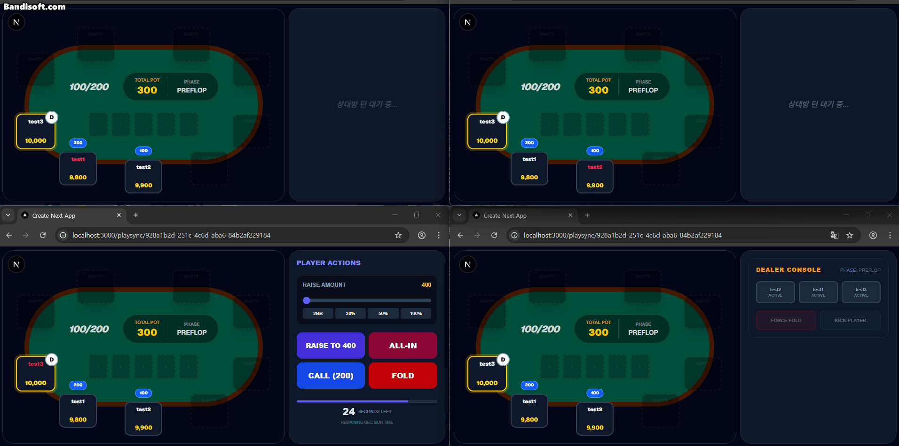
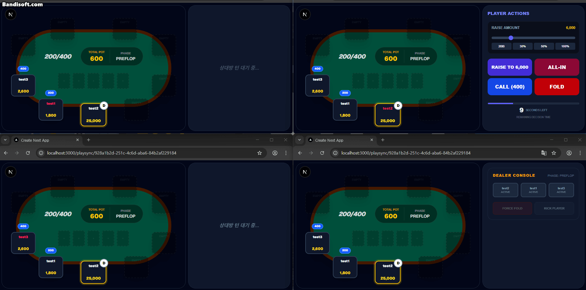
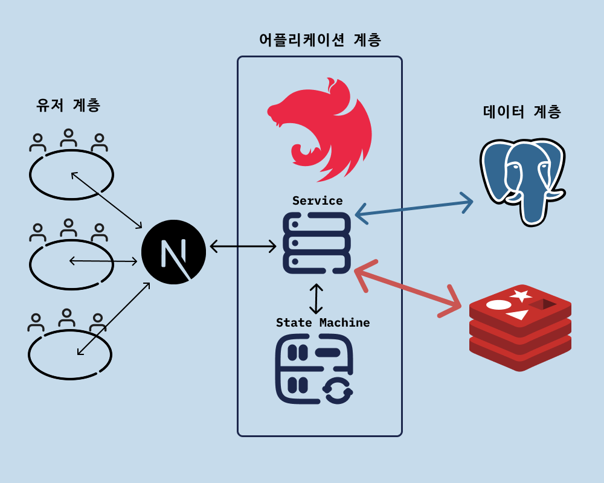
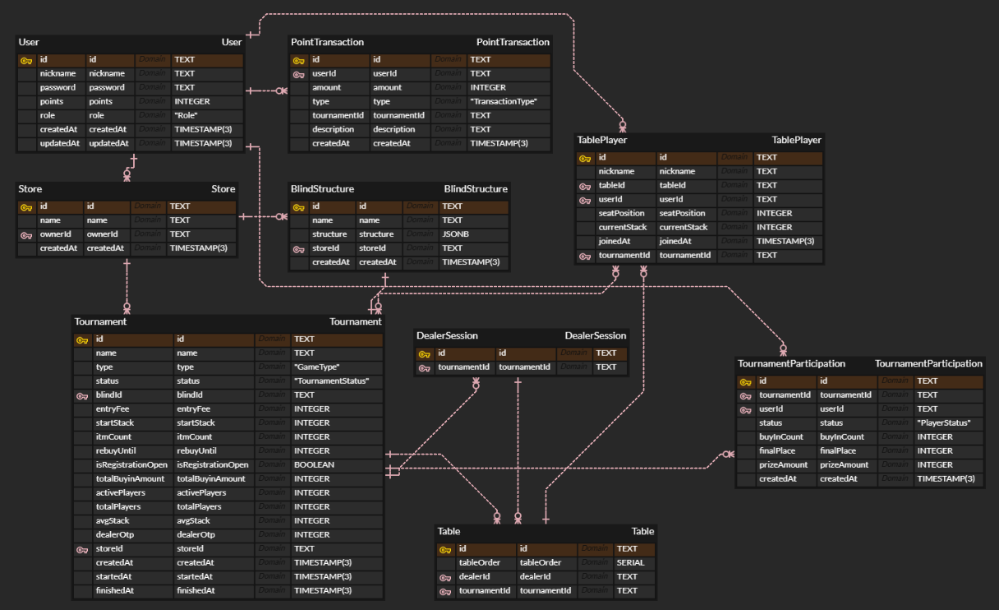
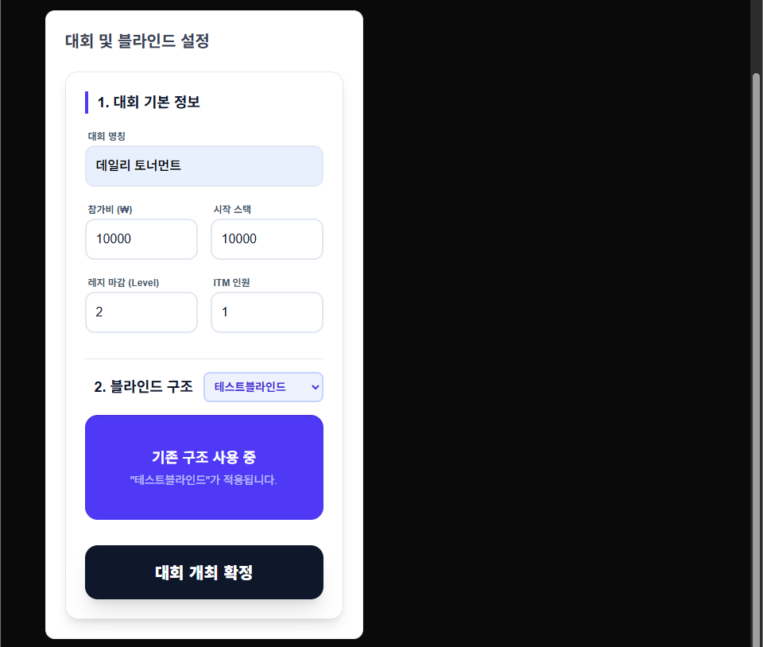
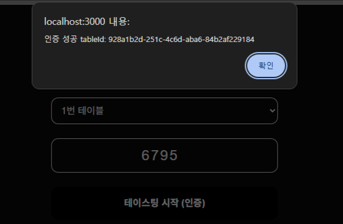
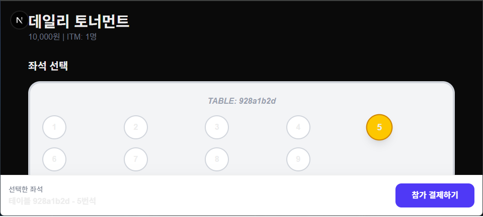
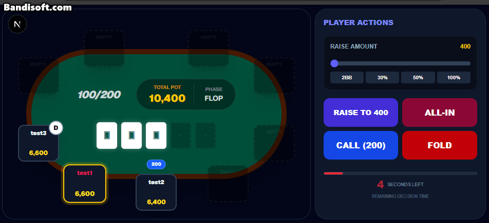
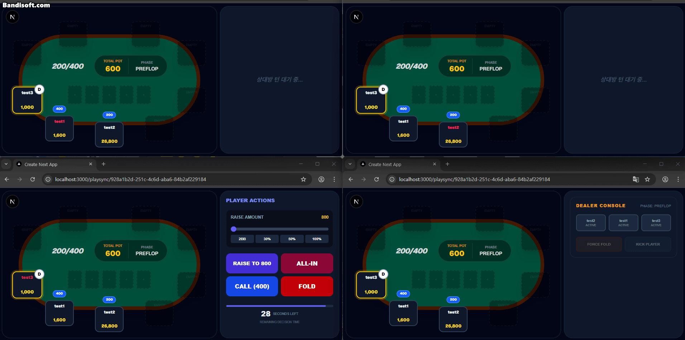

# Playsync: 오프라인 홀덤 토너먼트의 디지털 전환 SaaS 시스템 기반 MVP
> 오프라인 홀덤은 딜러의 실수, 플레이어의 턴 실수, 칩 계산 착오 등 실수가 빈번합니다.
> 이를 디지털로 풀어내어 실수를 줄이고 데이터정합성을 보장하고 본질에 집중할수 있는 시스템을 구축하고자 했습니다.

> **이 문서는 MVP 시점의 기록입니다.**
> 현재 리포지토리는 MVP에서 발견한 문제를 고쳐 나가는 V2 단계이며,
> 최신 구조와 도메인 규칙은 [`docs/README.md`](./docs/README.md)에 있습니다.
> 아래 내용 중 V2에서 달라진 부분은 그때마다 표시해 두었습니다.

---
## 🛠 기술 스택
- **Backend**: NestJS, WebSocket
  - 모듈 단위의 의존성 주입을 통해 로직을 구조화하고 유지보수성을 높였습니다.
  - WebSocket: 실시간 상태 공유를 통해 테이블/플레이어/토너먼트 진행을 동기화합니다.
- **Queue / Event**: BullMQ, EventEmitter
  - BullMQ: 플레이어 액션 30초 타임아웃을 지연 잡으로 처리합니다. `jobId`에 타이머 세대(`timerEpoch`)를 붙여, 낡은 잡이 남아 있어도 세대 불일치로 스스로 폐기되게 했습니다.
  - EventEmitter: 리바인 확인처럼 유저 응답을 기다려야 하는 비동기 흐름을 이벤트 기반(`once`)으로 처리해 서비스와 게이트웨이의 결합을 낮췄습니다.
- **Frontend**: Next.js
  - Server Action을 활용하여 httpOnly쿠키로 안전한 인증 로직을 구현하고 빠른 개발환경 구축을 위해 사용했습니다.
- **Database**: Redis, PostgreSQL
  - 수시로 변하는 게임 상태를 빠르게 읽고 쓰며, 서버는 웹소켓과 게임로직 처리를 담당시키기 위해 활용했습니다.
  - Redis Persistence(AOF)를 켜 두어 프로세스가 죽어도 스냅샷 자체는 남습니다. 다만 그것을 읽어 게임을 되살리는 복구 로직은 아직 없습니다(V2에서 진행 예정).
- **Auth**: JWT
  - 인증정보를 안전하게 처리하고 확장에도 유연하게 대응하기 위해 도입하였습니다.
- **ETC**: Prisma, Docker
  - Type-safe한 환경에서 개발 생산성과 안정성을 높이고, 초반 잦은 스키마 변경에 대응했습니다.
  - Docker: 추후 배포시 환경의 일관성을 유지하고, 개발환경을 빠르게 구축하기위해 사용했습니다.
---
## 🚦 구현 범위

### ✅ 구현 완료
- 토너먼트 생성 / 블라인드 구조 등록·재사용
- 좌석 선점(Redis 분산 락) 및 포인트 결제 기반 참가
- 딜러 OTP 인증 및 딜러 콘솔(폴드/킥/승자 결정)
- 상태머신 기반 베팅 라운드 진행 (체크/콜/폴드/레이즈/올인)
- 사이드팟 계산 및 콜되지 않은 베팅 환급
- 액션 30초 타임아웃 자동 처리 (BullMQ 지연 잡)
- Lazy Update 방식 블라인드 레벨 상승 (핸드 시작 시점 계산)
- 핸드 종료 시 리바인 유도 (15초 응답 대기, 즉시 상태 전파)
- 탈락 처리 및 등수 기록, 최후 1인 우승 처리
- 프라이즈풀 기반 상금 분배 및 포인트 지급 (V2)
- 동점(보드 하이) 분배 및 나머지 칩 처리 (V2)

### 🚧 미구현 / 개발 예정
- 테이블 밸런싱(자리 이동) — `SessionService.manualMovingPlayer()` 스텁 상태
- 다중 테이블 좌석 매핑
- SIT_AND_GO 모드 — 스키마만 존재
- 실제 PG 결제 연동 — 현재 포인트 차감 모의 처리
- 플랫폼/상점 어드민 기능
- 서버 다운 복구 시 블라인드 미루는 로직 (startedAt 보정)
- 사용자 친화적인 UI

---
## 🚀 실행 방법

### 사전 요구사항
- Node.js, Docker

### 1. 인프라 실행 (PostgreSQL 18 + Redis 7)
```bash
cd backend
docker-compose up -d
```

### 2. 환경 변수
`backend/.env` 파일에 아래 변수를 설정합니다.
```env
DATABASE_URL=postgresql://root:<password>@localhost:5432/playsync
DATABASE_PASSWORD=<password>   # docker-compose에서 사용
JWT_SECRET=<secret>
REDIS_HOST=localhost
REDIS_PORT=6379
REDIS_PASSWORD=<password>      # docker-compose에서 사용
```

### 3. Backend (http://localhost:3001)
```bash
cd backend
npm install
npx prisma migrate dev
npm run start:dev
```

### 4. Frontend (http://localhost:3000)
```bash
cd frontend
npm install
npm run dev
```

---
## 📦 프로젝트 구조 (Backend)

| 모듈 | 역할 |
|---|---|
| `game-engine` | 프레임워크 의존성이 없는 순수 TypeScript 포커 상태머신 (베팅 라운드, 사이드팟, 페이즈 전환) |
| `playsync` | 게임 진행 오케스트레이션 (액션 처리, 타임아웃, 리바인, 탈락, DB 동기화) |
| `dealer` | 딜러 OTP 인증, 딜러 액션 (프리플랍 시작, 폴드/킥, 승자 결정) |
| `ws` | WebSocket 게이트웨이 (테이블/토너먼트 세션 관리, 브로드캐스트) |
| `payment` | 좌석 선점 락, 참가 결제, 좌석 현황 |
| `store` | 매장/토너먼트 세션 관리 (생성, 시작, 종료, 블라인드 등록) |
| `redis` | 게임 상태 스냅샷, 대회 메타정보, 좌석 비트맵, 유저 컨텍스트 |
| `auth` / `user` | JWT 인증, 유저/포인트 관리 |

### WebSocket 프로토콜 (`/playsync`)

| 방향 | 이벤트 | 설명 |
|---|---|---|
| 클라 → 서버 | `PLAYER_ACTION` | 체크/콜/폴드/레이즈 액션 |
| 클라 → 서버 | `DEALER_ACTION` | 프리플랍 시작, 승자 결정, 폴드/킥, 체크포인트 재시도 |
| 클라 → 서버 | `REBUY_RESPONSE` | 리바인 수락/거절 응답 |
| 서버 → 클라 | `renderGame` | 테이블 상태 브로드캐스트 |
| 서버 → 클라 | `renderSeatList` | 좌석 현황 브로드캐스트 (예매 화면) |
| 서버 → 클라 | `REBUY_PROMPT` | 리바인 확인 팝업 요청 (개별 유저) |

---
## 🧐 트러블슈팅
- **실시간 게임 로직의 테이블별 상태 정합성 보장**
  - 블라인드 레벨 상승 시 진행 중인 핸드에 즉시 영향을 주지 않도록, 각 테이블 세션별로 상태 스냅샷을 관리하여 핸드 종료 이후부터 적용되는 로직을 설계했습니다.
  - 서버 타이머에 의존하는 대신 Lazy Update 방식을 채택했습니다. 저장된 레벨이 아니라 `startedAt`과 현재 시각이 진실이라, 조회 시점에 다시 계산하고 바뀌었을 때만 갱신합니다. 서버가 재기동해도 레벨이 되돌아가지 않고, 폴링이 밀리면 여러 레벨을 한 번에 따라잡습니다.
  - 다만 WebSocket 세션은 게이트웨이의 인메모리 Map에 있어 완전한 Stateless는 아닙니다. 현재는 단일 프로세스 전제입니다.
  - 여러 테이블에서 동시에 블라인드 레벨 체크시 증가 연산이 아닌 블라인드 레벨 인덱스를 기준으로 갱신해 경쟁 상태에 강한 구조를 구현했습니다.
- **비동기 콜백 구조에서의 실시간 상태 동기화 및 UX 최적화**
  - 핸드 종료 시 스택이 0이 된 플레이어들을 대상으로 리바인을 유도할 때, 특정 유저가 결정을 완료했음에도 다른 유저의 응답(최대 15초)이 끝날 때까지 자신의 스택 갱신을 확인하지 못하는 사용자 경험의 불확실성을 확인했습니다.
    - 이를 해결하기 위해 비동기 콜백 호출 시 메모리상의 동일한 주소를 가리키는 테이블 객체 인스턴스를 인자로넣어, 개별 트랜잭션 성공 시 해당 메모리 값을 상태머신에서 수정하고 이를 즉시 전파하는 방식을 채택했습니다.
    - EventEmitter의 `once` 패턴으로 유저별 응답 이벤트(`rebuy_res_${userId}`)를 대기시키고, 15초 타이머와 경쟁시켜 어느 쪽이 먼저 오든 한 번만 resolve되도록 처리했습니다.
    - 결과적으로 모든 플레이어의 응답이 완료되기 전이라도 즉각적인 피드백을 제공함으로써, 실시간 게임의 반응성을 극대화하는 동시에 최종 데이터 정합성을 확보했습니다.
- **N+1 쿼리 최적화 및 동시성 제어**
  - 핸드 종료시, 스택이 0이 된 플레이어들을 대상으로 리바인 유도 및 탈락로직 실행시 불필요한 I/O 발생.
    - 리바인유도 로직 내에서 공통된 정보는 상위 컨텍스트 주입을 통해 반복적으로 시행되던 읽기 횟수를 줄였습니다.
    - 탈락 확정 플레이어들을 In 절과 updateMany/deleteMany를 이용한 단일 트랜잭션으로 묶어, 쿼리 복잡도를 최적화하고 동시 탈락 시의 등수 정합성을 보장했습니다.
- **테이블 단위 액션 타임아웃 관리**
  - 플레이어별로 타이머를 만들면 턴이 넘어갈 때마다 이전 타이머 추적/제거가 복잡해지는 문제가 있었습니다.
  - 처음에는 `jobId`를 테이블 ID로 고정해 테이블당 활성 타이머가 하나만 있게 했습니다. 그런데 제거에 실패한 상태에서 다시 등록하면 BullMQ가 같은 id의 잡이 이미 있다고 보고 조용히 무시했고, 그 잡이 끝나면 **타이머가 없는 테이블**이 남았습니다.
  - V2에서 `jobId`에 세대(`timerEpoch`)를 붙였습니다. 새 잡은 충돌하지 않고, 낡은 잡은 제거 성공 여부와 무관하게 세대 불일치로 스스로 폐기됩니다. 판정 기준도 잡의 발화 시각이 아니라 `actionDeadline`(마감 시각)으로 바꿔, 마감 뒤에 도착한 액션은 잡보다 먼저 와도 시간 초과로 처리합니다.
- **객체지향 원칙을 통한 물리 구조의 추상화**
  - 초기 설계 시 딜러와 물리 테이블이 로직들에 강하게 결합되어 확장성이 저해되는 문제를 겪었습니다. 이를 추상화된 개념으로 분리하여 물리적 환경에 구애받지 않는 유연한 구조를 구축했습니다.
  - 게임 엔진(`TableEngine`)은 NestJS 의존성이 없는 순수 클래스로 분리하여, 인프라 없이 단위 테스트가 가능한 구조로 설계했습니다.
- **Prisma 7.4 도입 및 트러블슈팅**
  - 라이브러리 사용법이 바뀌었고 AI가 제공해준 라이브러리 적용 코드들이 동작하지않아 공식문서를 찾아보며 해결했습니다.
  - https://docs.nestjs.com/recipes/prisma
- **인프라 보안 설정의 중요성 체감**
  - Docker 컨테이너 기반 Redis 사용 시, 바인딩 설정 미비로 인한 보안 취약점을 발견했습니다. 환경변수를 통한 인증(Requirepass) 설정으로 외부 접근을 차단하고 보안을 강화했습니다.
---
## 🎉 프로젝트 성과 및 목적
- 사용자수가 많을것으로 가정한 효율 중심의 아키텍처 설계를 진행했습니다.
  - 기존에 진행했었던 CRUD위주의 프로젝트와 달리 Redis/DB의 역할을 분리해서 서버는 로직처리만 담당하는 구조를 설계해 보았습니다.
  - 결과 정산 시점에만 DB 트랜잭션을 실행하는 Write-back 패턴을 적용했습니다. **플레이어 액션 경로에서 DB 쓰기는 0회** — 핸드당 수십 회 발생하는 상태 변경은 전부 Redis에서 처리되고, DB에는 정산·탈락·상금 같은 경계 이벤트에서만 기록됩니다. (딜러 킥은 대회 참가 상태를 바꾸므로 그 자리에서 DB를 만집니다.)
  - 사용자 응답 수집(재참여 의사)시 Promise.all 기반의 비동기 병렬 처리를 도입하여, 다수 사용자의 데이터를 동시에 처리하는 효율적인 로직을 구현했습니다.

---

<details>
  <summary><h2>🔥 핵심 로직</h2></summary>
  
  <p>첫 레이즈 이후 더 큰 벳이 나오면 새로운 액션기회를 가집니다.</p>
  
  <p>레이즈, 올인, 폴드 일때 액션 가능한 플레이어가 없으므로 쇼다운페이즈로 진입합니다.</p>
  
  <p>딜러콘솔에서 클릭한 순서대로 핸드가 강한순입니다. (V2에서는 동점 그룹의 배열 <code>[['a','b'], ['c']]</code>로 바뀌어 보드 하이를 표현할 수 있습니다.)</p>
  <p>1000을 베팅한 test3 3000, test2 보다 test1이 높은패 인 상황에 test1이 나머지팟을 가져갑니다</p>
  
  <p>딜러가 승자결정시 상태수정, 0인 플레이어 탈락처리, 상태 기준으로 db업데이트, 0인플레이어를 상태에서 제거합니다.</p>
</details>

<details>
  <summary><h2>🗺️ 설계 전체</h2></summary>
  <details>
    <summary><h3>아키텍쳐</h3></summary>
    
  </details>
  <details>
    <summary><h3>ERD</h3></summary>
    
  </details>
  <details>
    <summary><h3>플로우 차트</h3></summary>
    
  </details>
</details>


## 📌 사용 흐름

<details>
  <summary><h3>🎉 토너먼트 생성</h3></summary>
  
  <p>상점 관리페이지에서 토너먼트 생성 시 블라인드 구조를 새로 등록가능합니다.</p>
  
  <p>기존의 블라인드를 설정해두었다면 재사용 가능합니다.</p>
</details>
<hr>
<details>
  <summary><h3>🥷 딜러 인증</h3></summary>
  
  <p>토너먼트가 생성되면 딜러 OTP가 발급됩니다.</p>
  
  <p>OTP 검증 화면입니다.</p>
  
  <p>OTP 검증 화면입니다.</p>
</details>
<hr>
<details>
  <summary><h3>🙋‍♂️ 유저 착석</h3></summary>
  
  <p>유저는 원하는 자리에 앉을 수 있습니다.</p>
  
  <p>우측 하단은 딜러화면이고,다른 플레이어가 이미 결제한 자리는 빨간색으로 표시됩니다.</p>
  
  <p>모든 플레이어가 웹소켓으로 접속해있는 화면입니다.</p>
  
  <p>관리페이지에서 대회를 시작하면 해당 대회정보를 Redis에 올리게됩니다.</p>
</details>
<hr>
<details>
  <summary><h3>⌨️ 상태머신을 통한 실시간 화면</h3></summary>
  
  <p>test1 플레이어가 30초 이내로 액션을 하지않았습니다.</p>
  
  <p>test2 플레이어가 30초 이내로 액션을 하지않았고, 콜 할 금액이 없어 자동으로 체크.</p>
  
  <p>딜러가 test2 플레이어에게 승리를 선언합니다.</p>
  
  <p>테이블별 블라인드는 핸드 시작 시점에 업데이트됩니다.</p>
  
  <p>사이드팟이 생기는 상황입니다. test2 플레이어가 콜할 금액이 높아져 액션을 더 진행했습니다.</p>
</details>


---
