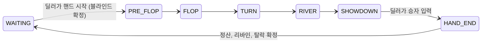
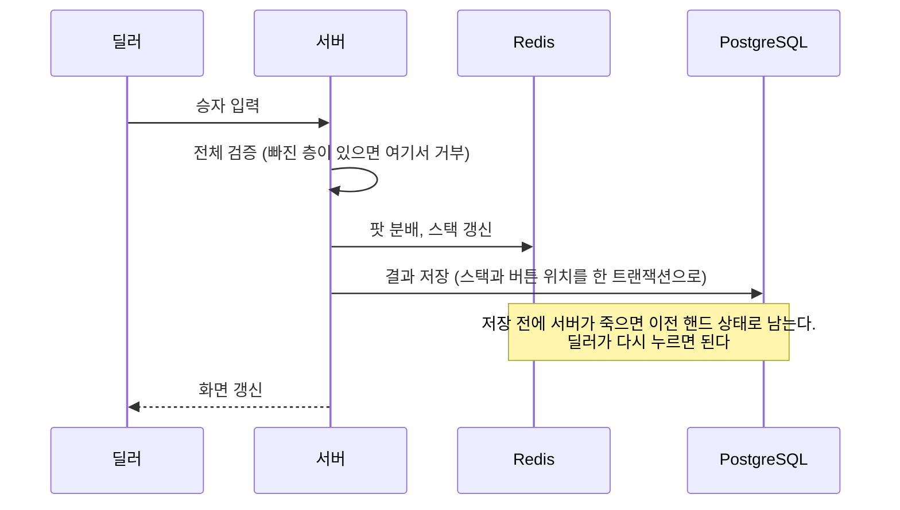
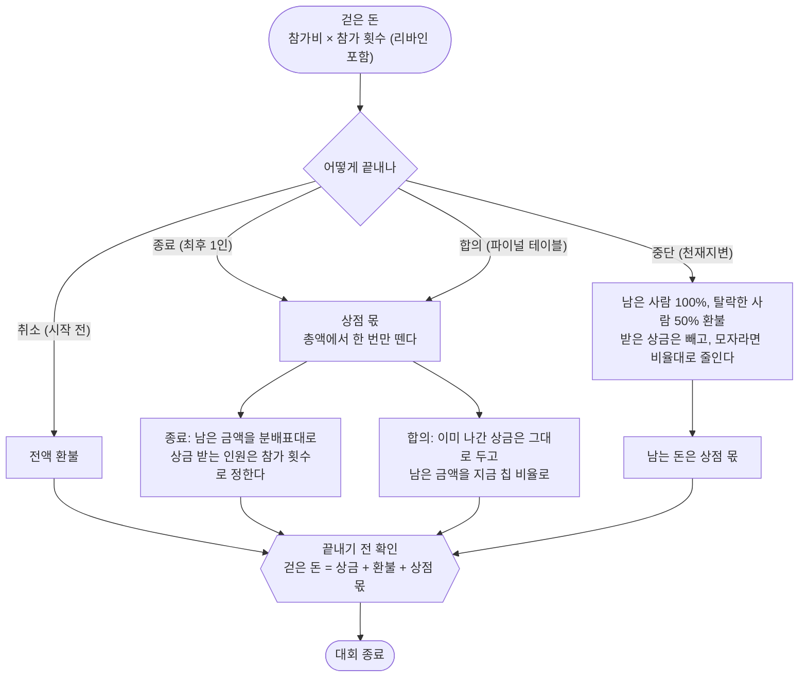
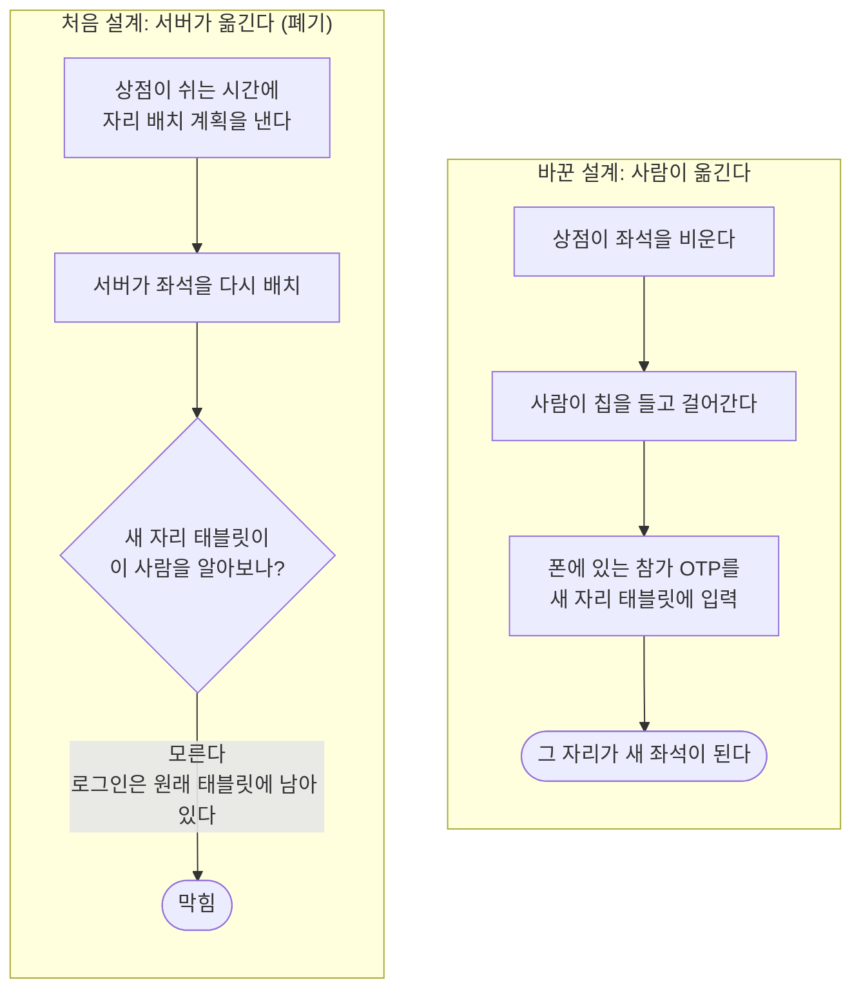
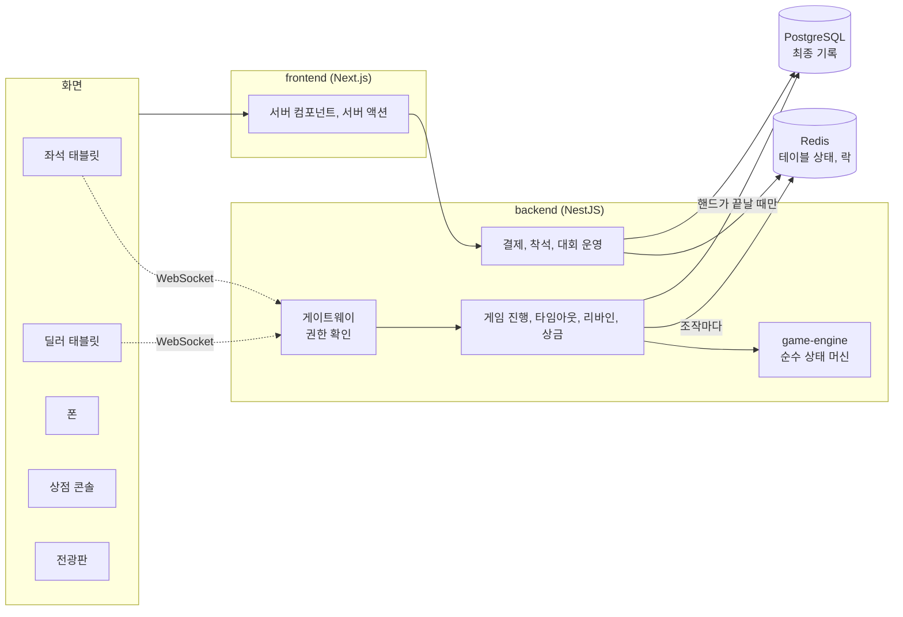

# Playsync V2

**오프라인 홀덤 대회를 운영하는 시스템을 기준으로 잡고 구현한 사이드 프로젝트입니다.**
카드는 사람 딜러가 실물로 돌리고, 칩과 팟, 좌석, 상금은 서버가 관리합니다.

아래 그림 일곱 장은 대회 하나가 시작해서 끝나기까지의 과정입니다. 위에서부터
대회가 진행되는 순서대로 놓았습니다.


> **①** 폰에서 참가비를 내고 받은 번호를 자리 태블릿에 입력하면 상점 콘솔에 그 사람이 표시된다.


> **②** 대회를 시작해야 딜러가 핸드를 시작할 수 있다. 버튼 한 번에 네 화면이 함께 바뀐다.


> **③** 카드는 사람이 돌리고 승자도 딜러가 입력한다. 대신 사이드팟을 빠뜨리면 지급이 거부된다.


> **④** 탈락하면 남은 인원이 줄고, 리바인하면 참가 횟수가 오른다.


> **⑤** 테이블을 합칠 때는 사람이 직접 걸어가서 다시 앉는다. 자리를 옮겨도 칩은 그대로 따라간다.


> **⑥** 대회를 끝내는 방법은 두 가지다. 합의해서 남은 칩 비율대로 나누거나, 승자를 가려 분배표대로 나눈다.


> **⑦** 대회를 중단하면 낸 돈을 돌려준다. **어떤 방법으로 끝내도 걷은 돈은 상금, 환불, 상점 몫으로 정확히 나뉜다.**

```
TypeScript, NestJS 11, Next.js, PostgreSQL, Redis, zod, npm workspaces
테스트: contract 85 / 백엔드 단위 445 / 프론트 331 / 통합 725 / e2e 13 / 부하 도구 39 / 실제 kill 26 / 타입 에러 0
```

> **이 리포지토리가 하는 일**
> V1 MVP는 "돌아가긴 한다"에서 멈춰 있었다. V2는 그 코드를 가져와 **"정확하게
> 돌아간다"**로 만드는 작업이고, 에이전트 코딩으로 진행했다. 무엇을 검증할지(부하 실측, Redis와 백엔드를 실제로 죽이는 테스트, 단계마다
> 불변식을 확인하는 시나리오)와 무엇을 하지 않을지는 사람이 정했다.

---

## 1. 도메인: 카드는 실물, 칩은 디지털

사람 딜러가 실물 카드를 돌리는 오프라인 대회다. 온라인 홀덤이라면 서버가 카드를
돌리고 알아서 다음 단계로 넘어가지만, 여기서는 **딜러가 버튼을 눌러야 게임이
진행된다.** 그래서 딜러의 조작과 플레이어의 조작이 같은 상태를 동시에 건드리고,
동시성 문제가 예외가 아니라 기본으로 깔려 있다.


```mermaid
stateDiagram-v2
    direction LR
    WAITING --> PRE_FLOP: 딜러가 핸드 시작 (블라인드 확정)
    PRE_FLOP --> FLOP
    FLOP --> TURN
    TURN --> RIVER
    RIVER --> SHOWDOWN
    SHOWDOWN --> HAND_END: 딜러가 승자 입력
    HAND_END --> WAITING: 정산, 리바인, 탈락 확정
```

`WAITING`과 `HAND_END`는 시스템이 사람을 기다리는 구간이다. `SHOWDOWN`에서는 누구의
차례도 아니다. 딜러가 카드를 확인하는 동안 다른 사람 태블릿에서 제한 시간이 흐르면
안 되기 때문이다.

### 승부는 딜러가, 장부는 시스템이

카드가 실물이니 승부는 딜러가 정한다. 서버에는 정답이 없으므로 딜러의 입력을 믿고,
대신 **장부가 틀리지 않게 막는다.**


- 팟이 몇 층으로 나뉘는지, 층마다 누가 가져갈 자격이 있는지는 시스템이 계산해서
  보여 준다. 딜러는 순위만 입력한다.
- 승자를 지정하지 않은 층이 하나라도 있으면 **칩을 하나도 움직이기 전에 거부한다.**
- 나누고 남는 칩은 버튼 다음 자리부터 한 개씩 준다. 버리면 칩이 사라지고, 규칙을
  정하지 않으면 딜러마다 다르게 처리한다.

카드가 실물이라 **잘못 나간 칩을 되돌릴 근거가 테이블 위에 남지 않는다.** 그래서
핸드를 끝낼 때는 되돌릴 수 있는 일부터 한다.


```mermaid
sequenceDiagram
    participant D as 딜러
    participant S as 서버
    participant R as Redis
    participant DB as PostgreSQL
    D->>S: 승자 입력
    S->>S: 전체 검증 (빠진 층이 있으면 여기서 거부)
    S->>R: 팟 분배, 스택 갱신
    S->>DB: 결과 저장 (스택과 버튼 위치를 한 트랜잭션으로)
    Note over R,DB: 저장 전에 서버가 죽으면 이전 핸드 상태로 남는다.<br/>딜러가 다시 누르면 된다
    S-->>D: 화면 갱신
```

### 칩이 디지털이라 장부가 맞아야 끝난다

칩과 상금은 서버가 관리한다. 그래서 대회는 **돈이 한 푼도 어긋나지 않아야 끝낼 수
있다.** 대회를 끝내는 방법은 네 가지이고 돈이 나가는 방식도 제각각이지만, 끝내기
전에 확인하는 것은 등식 하나다.


```mermaid
flowchart TB
    in(["걷은 돈<br/>참가비 × 참가 횟수 (리바인 포함)"]) --> door{어떻게 끝내나}
    door -->|"취소 (시작 전)"| r1["전액 환불"]
    door -->|"종료 (최후 1인)"| rake["상점 몫<br/>총액에서 한 번만 뗀다"]
    door -->|"합의 (파이널 테이블)"| rake
    rake --> p1["종료: 남은 금액을 분배표대로<br/>상금 받는 인원은 참가 횟수로 정한다"]
    rake --> p2["합의: 이미 나간 상금은 그대로 두고<br/>남은 금액을 지금 칩 비율로"]
    door -->|"중단 (천재지변)"| r2["남은 사람 100%, 탈락한 사람 50% 환불<br/>받은 상금은 빼고, 모자라면 비율대로 줄인다"]
    r2 --> rest["남는 돈은 상점 몫"]
    r1 & p1 & p2 & rest --> gate{{"끝내기 전 확인<br/>걷은 돈 = 상금 + 환불 + 상점 몫"}}
    gate --> closed([대회 종료])
```

<table>
<tr>
<td width="33%"></td>
<td width="33%"></td>
<td width="34%"></td>
</tr>
</table>

- 상점 몫을 참가할 때마다 떼면 버리는 끝전이 참가 수만큼 쌓여 등식이 깨진다. 그래서
  총액에서 한 번만 뗀다.
- 상금 받는 인원을 사람 수로 정하면 총상금(참가 횟수 × 참가비)과 기준이 달라진다.
  그래서 리바인을 포함한 참가 횟수로 정한다.
- 한 핸드에서 여러 명이 동시에 칩을 다 잃으면 등수가 한 자리가 아니라 **여러 자리에
  걸친다.** 핸드를 시작할 때 가지고 있던 칩으로 순서를 가른다.

---

## 2. 어떻게 풀지 정한 것

### 레이스 컨디션: 락을 어디까지 걸 것인가

딜러와 플레이어가 같은 테이블 상태를 동시에 바꾼다. 락을 걸어야 하는 곳과 걸면 안
되는 곳을 가르는 것이 이 프로젝트의 중심 문제였다.

1. **사람을 기다리는 구간은 락 밖으로 뺐다.**
   - a. 문제: 핸드가 끝나면 칩을 다 잃은 사람에게 리바인을 묻고 최대 15초를 기다리는데,
     그동안 테이블 락을 쥐고 있어 테이블 전체가 멈췄다.
   - b. 조건: 여러 사람에게 동시에 묻고, 마감을 같게 하고, 수락하면 바로 반영한다.
   - c. 결과: 정산을 세 구간으로 나눴다. 팟 분배는 락 안, 리바인 대기는 락 밖, 탈락
     확정과 다음 핸드 준비는 다시 락 안이다. 락 밖 구간에는 다음 핸드가 끼어들 수 없다.
     핸드 시작은 `WAITING` 상태에서만 되기 때문이다.
2. **락 밖의 틈은 도메인 구조로 감수했다.**
   - a. 문제: 조작 하나는 원자적이지만 핸드 전체는 다섯 구간이고 그중 둘이 락 밖이다.
     테이블 상태를 쓰는 경로 여덟 곳은 막는 방법이 제각각이었다.
   - b. 판단: 좌석 해제나 테이블 삭제는 운영자가 쉬는 시간에 테이블 앞에서 하는 일이다.
     핸드 도중에 **들어올 수 없는 것이 아니라 들어올 일이 없다.** 그래서 틈을 전부 락으로
     막지 않는다.
   - c. 결과: 전제가 깨졌을 때 조용히 틀리지 않도록 상태 검사만 남겼다.
3. **테스트를 고치지 않고 코드를 고쳤다.**
   - a. 문제: 착석과 액션이 동시에 들어오는 테스트가 세 번 돌아도 실패를 재현하지 못했다.
     테스트가 락을 먼저 잡게 해서 재현하는 방법이 있었지만, 그러면 제품 코드는 그대로다.
   - b. 판단: 핸드 도중 늦게 온 사람을 폴드 상태로 앉히는 것만 봤고, 앉는 요청과 다른
     사람의 액션이 같은 순간에 들어오는 경우를 놓쳤다. 테스트가 아니라 코드를 고친다.
   - c. 발견: 테이블 상태를 고치는 경로 11곳이 모두 락을 잡고, 읽고, 고치고, 쓰는 과정을
     직접 반복하고 있었다. 락 안에서 다시 읽는 한 줄이 유일한 방어였다.
4. **관행을 구조로 바꿨다.**
   - a. 문제: 전수조사해 보니 테이블 상태를 쓰는 곳이 14곳이었고, 락 밖에서 읽은 값으로
     쓰는 곳은 없었다. 하지만 그 줄을 지워도 실패하는 테스트가 없었다.
   - b. 결과: 락, 읽기, 쓰기를 함수 하나(`mutateSnapshot`)가 맡게 하고 14곳을 한 번에
     옮겼다. 호출하는 쪽에서 상태를 직접 읽지 않으니 다시 읽기를 빠뜨릴 자리가 없다.
     락 없이 쓰는 네 곳은 이유를 인자로 남기게 했다.
5. **블라인드 레벨 동기화에는 락을 걸지 않았다.**
   - a. 문제: 블라인드 레벨을 읽고 고쳐 쓰는 과정에 락이 없다는 점이 위험으로 올라왔다.
   - b. 판단: 블라인드는 대회 전체가 함께 보는 값이다. 락을 걸면 한 테이블이 핸드를
     시작하는 동안 다른 테이블이 시작하지 못한다.
   - c. 결과: 락을 걸지 않고, 그 이유를 코드 주석으로 남겼다. 테이블마다 독립적으로
     핸드를 시작한다.

### 테이블 사이 이동: 서버가 옮기는 방식에서 사람이 옮기는 방식으로


```mermaid
flowchart LR
    subgraph before["처음 설계: 서버가 옮긴다 (폐기)"]
        direction TB
        a1["상점이 쉬는 시간에<br/>자리 배치 계획을 낸다"] --> a2["서버가 좌석을 다시 배치"]
        a2 --> a3{"새 자리 태블릿이<br/>이 사람을 알아보나?"}
        a3 -->|"모른다<br/>로그인은 원래 태블릿에 남아 있다"| ax(["막힘"])
    end
    subgraph after["바꾼 설계: 사람이 옮긴다"]
        direction TB
        b1["상점이 좌석을 비운다"] --> b2["사람이 칩을 들고 걸어간다"]
        b2 --> b3["폰에 있는 참가 OTP를<br/>새 자리 태블릿에 입력"]
        b3 --> b4(["그 자리가 새 좌석이 된다"])
    end
    before ~~~ after
```

1. **옮기는 것은 상점, 시점은 핸드 사이.** 누구를 언제 어디로 보낼지는 현장 판단이라
   자동 밸런싱은 빼고 상점이 옮긴다. 옮기는 시점은 쉬는 시간이 아니라 핸드와 핸드
   사이(`WAITING`)다. 대회 막바지에는 쉬는 시간이 아니어도 테이블을 합친다.
2. **서버가 좌석을 옮기는 설계를 구현 직전에 폐기했다.**
   - a. 문제: 처음에는 서버가 좌석 배치를 한 번에 다시 짜도록 설계했다. 현장에서는
     3/3/3명을 9명 한 테이블로, 4/4/5명을 6/7명 두 테이블로 한꺼번에 옮긴다. 여러
     테이블을 함께 잠그는 락, 2단계 임시 좌석, 배치 계획 검증까지 설계했다.
   - b. 판단: 서버가 좌석을 옮겨도 새 자리 태블릿은 그 사람이 맞는지 확인할 수 없다.
     로그인은 원래 태블릿에 남아 있고, 사람만 걸어간다.
   - c. 결과: **OTP는 사람을 따라간다.** 참가자마다 다른 OTP를 결제할 때 발급하고 폰에서
     언제든 다시 볼 수 있게 했다. 상점은 사람을 내보내지 않고 좌석만 비운다.
3. **좌석은 결제할 때가 아니라 앉는 순간 정한다.**
   - a. 문제: 결제할 때 좌석을 정하면 좌석 예매와 좌석 락이 필요하고, 자리를 옮겨도
     기록이 따라가지 않고, 오지 않은 사람의 자리가 막힌다.
   - b. 판단: 돈은 미리 내고 자리는 현장에서 정해진다. 둘을 떼어 낸다.
   - c. 결과: 좌석 예매와 Redis 좌석 락이 통째로 사라졌다. 같은 자리나 같은 사람을 두고
     요청이 겹치면 DB의 유니크 제약이 막는다.
4. **칩을 좌석 기록에서 참가 기록으로 옮겼다.**
   - a. 문제: 좌석을 비우면 좌석 기록이 지워지는데, 칩이 거기 저장돼 있었다.
   - b. 판단: 칩은 좌석보다 오래 살아야 한다. 좌석은 한 번에 한 테이블씩만 비우고,
     좌석 번호와 함께 사람 id도 확인한다.
   - c. 결과: 자리를 옮겨도 칩이 남는다. 여러 테이블을 동시에 잠그지 않으니 교착 상태가
     생길 수 없고, 오래된 화면에서 엉뚱한 사람을 빼는 요청은 거절된다.

### 서버가 멈췄다 돌아오면: 재시작이 끝이 아니었다

오프라인 대회는 서버가 멈춘 동안 실제로 진행되지 않는다. 멈춘 시간은 대회 시간에서
빼야 하고, 차례였던 사람이 그 사이 시간 초과로 자동 폴드되면 안 된다.

1. **멈춘 시간은 서버가 잰다.**
   - a. 문제: 멈춘 시간이 블라인드 시간에 그대로 들어갔다. V1에서는 상점이 멈춘 시각을
     기록하고 시작 시각을 미루는 방식으로 기획했다.
   - b. 판단: 별도의 일시정지 기능은 두지 않는다. 홀덤에서 운영자가 대회 전체를 멈추는
     일은 없다. 복구는 상점이 아니라 플랫폼의 책임이다.
   - c. 결과: 시작 시각을 둘로 나눴다. DB에는 실제로 시작한 시각을 그대로 두고, 블라인드
     계산용 기준 시각만 미룬다. 멈춘 시간은 서버가 DB에 5초마다 남기는 신호
     (하트비트)로 잰다. 주기가 곧 측정 오차라 처음 30초에서 5초로 줄였다. 복구용 API나
     화면은 만들지 않았다.
2. **게임을 다시 시작하는 시점은 딜러가 정한다.**
   - a. 문제: 블라인드 시간은 보정했지만 차례 제한 시간은 보정하지 않아, Redis에 남아
     있던 타이머가 재시작 직후 한꺼번에 만료됐다. 차례였던 사람이 자동 폴드됐다.
   - b. 판단: 처음에는 이전 타이머를 무효로 하고 차례를 다시 주면서 60초를 더 얹었다.
     하지만 60초는 근거 없는 값이다. 짧으면 아직 태블릿이 꺼진 사람이 폴드되고, 길면
     다 모인 테이블이 기다린다. 다시 시작할 권한은 테이블을 직접 보고 있는 딜러에게 준다.
   - c. 결과: 추가 시간을 없애고, 멈춘 테이블에서는 플레이어 조작을 거절하고, 딜러가 재개
     버튼을 누를 때 타이머를 다시 건다. 딜러 태블릿은 좌석 태블릿보다 **늦게** 다시
     연결되게 해서, 플레이어가 덜 돌아온 테이블을 먼저 시작하지 못하게 했다.
3. **대회 전체를 복구 중 상태로 둔다.**
   - a. 문제: 실시간 연결이 없는 폰과 전광판은 멈춘 대회를 정상 진행 중으로 보여 줬다.
     태블릿들이 다시 연결되는 동안에도 블라인드 시간이 흘렀다. 재시작할 때 한 번에
     보정하면 대회마다 복귀 시각이 다르다는 점을 반영하지 못한다.
   - b. 판단: 예전에 쓰지 않기로 하고 지웠던 `SYNCING` 상태를 되살린다. 그 대회의 딜러
     태블릿이 **모두** 다시 연결되면 푼다. 상점이 직접 푸는 안과 일정 시간 뒤 자동으로
     푸는 안은 기각했다. 연결 수로 세려면 실제로는 끊겼는데 서버가 모르는 연결부터
     정리해야 해서, 주기적인 연결 확인(ping/pong)을 먼저 넣었다.
   - c. 결과: 복구 중에는 모든 화면이 멈춘 대회로 표시하고 블라인드 시간도 멈춘다.
     풀리는 순간 멈춘 시간만큼 블라인드를 한 번 보정한다.
4. **Redis만 죽는 경우를 실제 끊김으로 검증했다.**
   - a. 문제: Redis만 죽으면 재시작 과정 자체가 없다. 장애를 검증하던 테스트는 상태 값을
     직접 바꿔 흉내 낼 뿐, 실제 연결 끊김을 지나지 않았다.
   - b. 판단: Redis 장애도 재시작과 같은 절차(대회를 멈추는 같은 함수)로 처리한다. Redis를
     실제로 내렸다 올리는 테스트를 만들라고 지시했다.
   - c. 결과: 장애 중에 에러를 낸다고 알고 있던 결제가 실제로는 **기록을 조용히 잃고
     있었다.**
5. **프로세스를 실제로 죽여 봤다.**
   - a. 문제: 흉내 낸 장애로는 부팅 과정과 남아 있던 타이머의 실제 동작을 확인할 수 없다.
   - b. 판단: `docker kill`로 Redis와 백엔드를 죽였다 살리는 테스트 환경을 만든다.
     리바인을 기다리는 중에 재시작하면 테이블이 멈춘다는 티켓은 그대로 믿지 않고 조사부터
     시켰다.
   - c. 결과: 테이블은 멈추지 않았다. 대신 칩을 다 잃은 사람이 등수와 상금을 받지 못한
     채 좌석에서 **사라졌다.** 마지막 탈락이 저장된 직후 연결이 끊기면 우승 상금이 끝내
     나가지 않아 대회를 끝낼 수 없다는 결함도 찾았다.

---

## 3. V1에서 V2로

V1은 혼자 만들고 크롬 창 네 개를 띄워 직접 눌러 보며 확인한 MVP다. 완료라고 적어  
둔 기능들은 정상적인 사용자가 정상적인 입력을 보낼 때만 맞았다.

| | V1에서 실제로는 | V2 |
|---|---|---|
| 돈과 권한 | 음수 레이즈로 칩이 생겼다. A 테이블 딜러가 B 테이블을 조작할 수 있었다 | 입력 검증, 게이트웨이의 권한 확인 |
| 동시성 | 락 없이 읽고 고치고 쓰는 코드가 네 곳에 있었다 | Redis 테이블 락 |
| 장부 | 사이드팟에서 칩이 사라졌다 | 사이드팟 합이 항상 팟과 같다 |
| 상금 | 지급 코드가 없어 기록만 남고 포인트가 나가지 않았다 | 지급을 한 곳으로 모으고, 정산이 끝나야 대회를 끝낼 수 있다 |
| 복구 | Redis로 복구를 보장한다고 적혀 있었지만 되살리는 코드가 없었다 | 2절 참고 |

출발점은 MVP 코드 전체 리뷰([`docs/archive/review.md`](./docs/archive/review.md))였다.

### 얼마나 버티나: 1코어 512MB에 12,420명

| 1,380개 테이블, 12,420명 전원 착석 | |
|---|---|
| 환경 | CPU 1코어, 메모리 512MB (클라우드 최저 사양 수준) |
| 안정 구간 | 내 조작 응답 p95 221ms, 서버 지연 중앙값 2.34ms, CPU 51.6%, 메모리 449MB |

- **수용 인원을 제한하던 것은 서버 사양이 아니라 Node 기본 힙 한도였다.** 11,790명에서
  Node가 자체 힙 한도(259MB)에 걸려 스스로 종료됐다. `--max-old-space-size=340` 한 줄로
  12,420명까지 올라갔다.
- **게임 진행은 가볍다.** CPU를 12코어에서 1코어로 줄여도 서버 지연이 그대로였다.
- **무거운 것은 입장이다.** 착석 비용의 71%가 비밀번호 해시(bcrypt)이고, 이 작업을
  동시에 몇 개 처리할지는 CPU 코어 수가 아니라 Node 내부 스레드 수(기본 4개)가 정한다.
  그래서 로그인 요청 수에 상한을 뒀고, **수용 인원은 동시 접속자 수가 아니라 초당 몇
  명이 들어오느냐로 정해진다.** 초당 5명은 여유 있고, 초당 9~10명이면 4분 만에 응답이
  느려진다.

> 참고: 12,420명 실측은 22분 중 대부분이 사람들이 차례로 들어와 앉는 시간이라, 테이블당
> 평균 3핸드만 돌았고 아무도 칩을 다 잃지 않아 리바인이 0이었다. 접속과 조작의 한계를
> 잰 것이지 탈락과 리바인까지 포함한 대회 전체의 한계는 아니다. 기록은
> [`docs/results/`](./docs/results/).

---

## 4. 테스트

| 계층 | 필요한 환경 | 잡는 것 |
|---|---|---|
| 단위 | 없음 | 게임 엔진 같은 순수 로직 |
| 통합 | 실제 Redis, PostgreSQL 컨테이너 | 락과 트랜잭션. 가짜 객체로 테스트하면 원자성을 확인할 수 없다 |
| 시나리오 | 위와 같음 | 부품은 각각 맞는데 조합이 틀린 경우 |
| 화면 회귀 | 시드 데이터 + 백엔드 (Playwright) | 응답 형식과 상태 변화. 위의 그림은 모두 이 테스트가 찍은 것이다 |
| 실제 kill | 전용 컨테이너 + 빌드한 백엔드 | `docker kill`로 실제로 죽여야만 드러나는 문제 |

시나리오 테스트는 칩 총량, 사이드팟 합, 좌석 기록과 테이블 상태의 일치 같은 불변식을
**단계마다** 확인한다. 마지막에 한 번만 확인하면 어딘가에서 칩이 사라졌다는 것까지만
알 수 있다.

**새로 만든 테스트가 처음부터 통과하면 의심한다.** 고친 코드를 일부러 되돌려서 테스트가
실패하는지 먼저 확인한다. 되돌려도 통과하는 테스트는 다른 곳에서 이미 막고 있었거나,
막는 장치가 두 개 겹쳐 있었거나, 테스트 자체가 틀린 경우였다.

---

## 5. 구조


```mermaid
flowchart LR
  subgraph faces["화면"]
    seat["좌석 태블릿"]
    dealerT["딜러 태블릿"]
    phone["폰"]
    console["상점 콘솔"]
    board["전광판"]
  end
  subgraph front["frontend (Next.js)"]
    next["서버 컴포넌트, 서버 액션"]
  end
  subgraph back["backend (NestJS)"]
    ws["게이트웨이<br/>권한 확인"]
    play["게임 진행, 타임아웃, 리바인, 상금"]
    rest["결제, 착석, 대회 운영"]
    engine["game-engine<br/>순수 상태 머신"]
  end
  redis[("Redis<br/>테이블 상태, 락")]
  db[("PostgreSQL<br/>최종 기록")]
  faces --> next
  seat -. WebSocket .-> ws
  dealerT -. WebSocket .-> ws
  next --> rest
  ws --> play --> engine
  play -- 조작마다 --> redis
  play -- 핸드가 끝날 때만 --> db
  rest --> redis
  rest --> db
```

npm workspaces 모노레포다. `backend`(NestJS), `frontend`(Next.js),
`packages/contract`(백엔드와 프론트가 함께 쓰는 zod 스키마)로 나뉜다. 플레이어가
조작할 때마다 Redis만 바뀌고, PostgreSQL에는 핸드가 끝날 때만 쓴다. 핸드 하나에
수십 번 바뀌는 상태가 DB에 부담을 주지 않는다.

---

## 6. 실행

```bash
cd backend && docker compose up -d   # PostgreSQL, Redis, 마이그레이션, 데모 시드

npm run dev:backend    # http://localhost:3001
npm run dev:frontend   # http://localhost:3000
npm run test           # 단위 테스트 (인프라 불필요)
npm run test:int       # 통합 테스트 (컨테이너 자동 실행)
npm run test:e2e       # 화면 회귀 (시드 먼저 실행)
npm run test:outage    # 실제 kill 테스트 (Docker 필요)
```

`backend/.env`에 `DATABASE_URL`, `JWT_SECRET`, `REDIS_HOST`, `REDIS_PORT`,
`REDIS_PASSWORD`가 필요하다. 프론트는 `frontend/.env.example`을 복사해 쓴다. 시드는
기존 데이터를 지우고 새로 만들기 때문에 개발 DB의 데이터가 사라진다.

---

## 7. 하지 않기로 한 것

| | 이유 |
|---|---|
| 딜러 태블릿별 신원 구분 | 얻을 것이 두 가지(태블릿 하나만 골라 내보내기, 감사 로그에서 딜러 구분)인데 지금은 둘 다 쓸 곳이 없다 |
| 관리자 화면, 감사 로그 | 기준은 장부가 맞고 대회가 제대로 끝나는 것이다. 상점 계정은 시드로 만든다 |

근거와 남은 결함은 [`docs/backlog.md`](./docs/backlog.md),
[`docs/tickets-audit.md`](./docs/tickets-audit.md),
[`docs/tickets-recovery.md`](./docs/tickets-recovery.md)에 있다. 도메인 규칙과 코드
위치는 [`docs/domain.md`](./docs/domain.md)에 있다.
