# Playsync V2

**오프라인 홀덤 대회를 운영하는 시스템을 기준으로 잡고 구현한 사이드 프로젝트입니다.**
카드는 사람 딜러가 실물로 돌리고, 칩·팟·좌석·상금은 서버가 맡습니다.

아래 그림 일곱 장이 대회 하나가 열리고 닫히기까지입니다. 읽는 순서가 곧 대회
순서입니다.

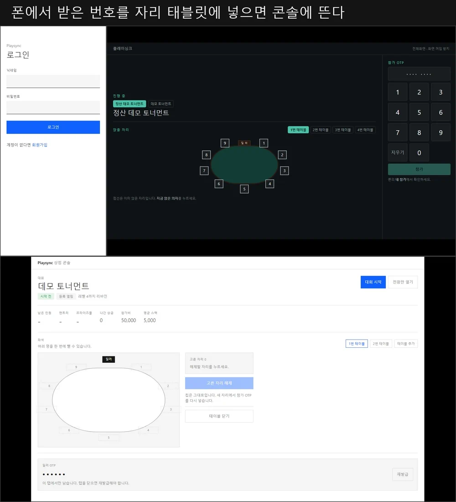

> **①** 폰에서 참가비를 내고 받은 번호를 자리 태블릿에 넣으면 상점 콘솔에 잡힌다.

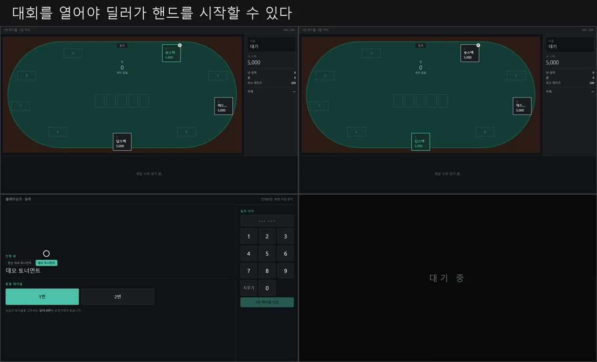

> **②** 대회를 열어야 딜러가 핸드를 시작한다. 한 클릭이 네 화면을 한꺼번에 바꾼다.

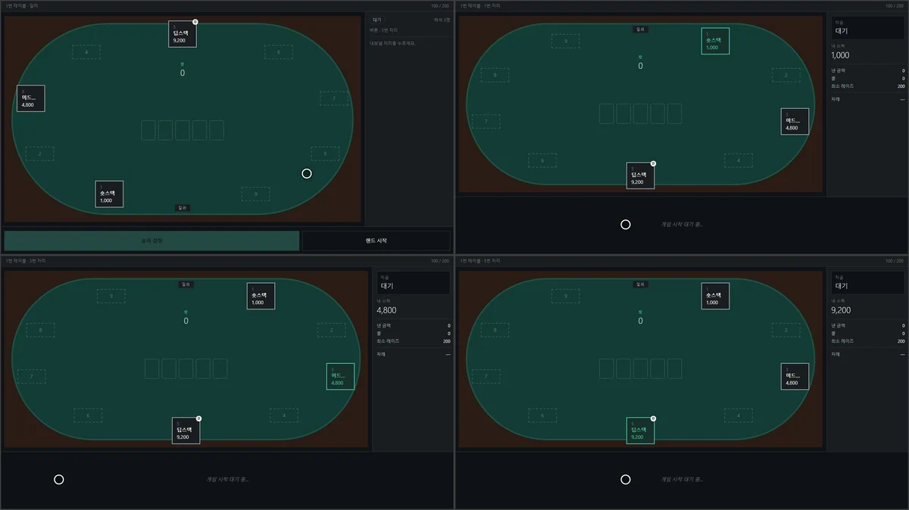

> **③** 카드는 사람이 돌리고 승자도 딜러가 찍는다. 대신 사이드팟을 빠뜨리면 지급이 거부된다.

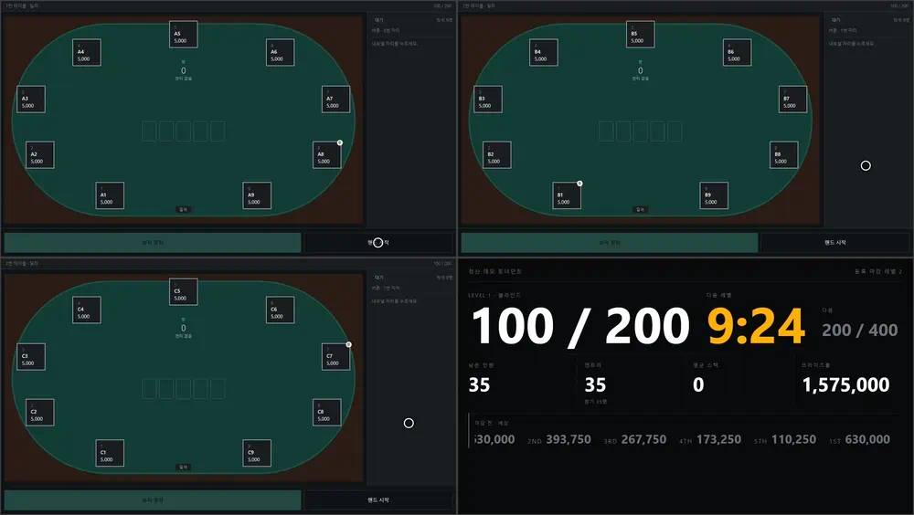

> **④** 남은 인원은 줄고, 리바인하면 엔트리가 오른다.

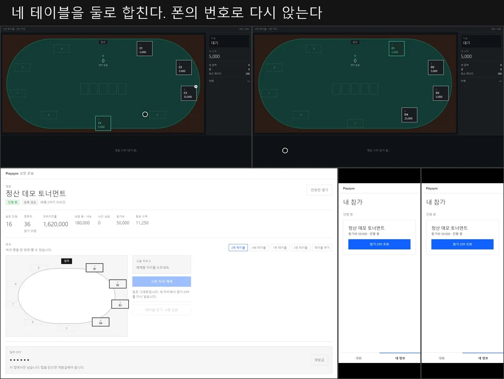

> **⑤** 테이블을 합치는 것은 사람이 걸어가는 일이다. 옮겨 앉아도 칩은 따라간다.

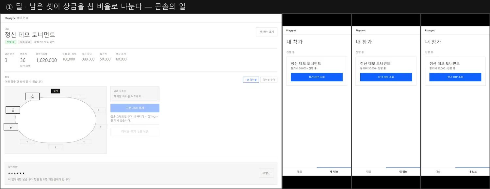

> **⑥** 끝내는 문이 둘 — 합의로 남은 칩만큼 나누거나, 승자를 지정해 분배표대로 나눈다.

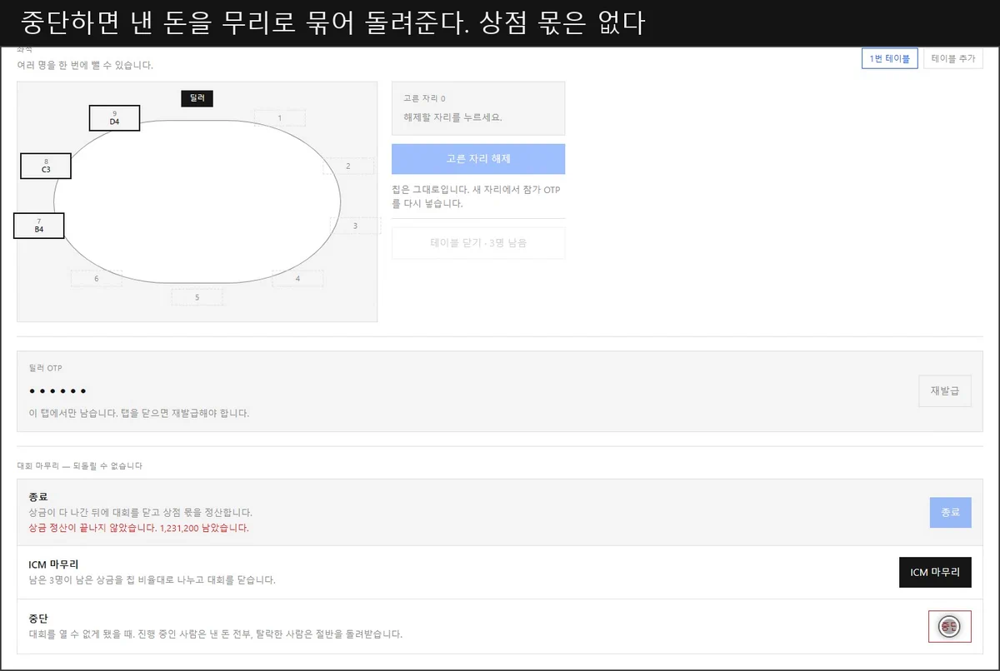

> **⑦** 중단하면 낸 돈을 전부 돌려준다. **어느 문으로 닫아도 걷은 돈은 상금과 환불과 상점 몫으로 정확히 나뉜다.**

```
TypeScript · NestJS 11 · Next.js · PostgreSQL · Redis · zod contract · npm workspaces
contract 82 · 백엔드 단위 407 · 프론트 273 · 통합 644(시나리오 21 스위트 포함) · e2e 13 · 부하 하네스 39 · 타입 에러 0
```

> **이 리포지토리가 하는 일**
> V1 MVP는 "돌아가긴 한다"에서 멈춰 있었다. V2는 그 코드를 옮겨 온 뒤
> **"정확하게 돌아간다"**로 만드는 작업이고, 그 과정 전체를 **에이전트 코딩으로**
> 진행했다. 판단 근거는 [`docs/chat-log.md`](./docs/chat-log.md)에 있다.

---

## 핵심 설계 결정

무엇을 만들었나보다 **왜 그렇게 만들었나**가 이 리포의 내용이다. 일곱 줄로 줄이면
이렇고, 근거와 코드 좌표는 §1부터다.

- **카드는 상태에 없다** — `TableState`에 덱도 홀카드도 커뮤니티 카드도 없다.
  셔플·핸드 랭킹·승자 판정이 없는 것은 누락이 아니라 **그 일이 테이블 위에서
  일어나기 때문**이다. 서버는 칩·팟·좌석·차례만 든다.
- **승자는 계산이 아니라 딜러 입력이다** — 검증할 정답이 서버에 없으니 입력을
  믿는다. 대신 **지명되지 않은 팟이 하나라도 있으면 한 칩도 움직이기 전에
  거부한다.** 판정은 사람이 하고 장부는 시스템이 지킨다.
- **되돌릴 수 없는 일을 마지막에 한다** — 핸드 종료는 Redis 정산 → DB 커밋,
  대회 시작은 Redis 준비 → DB 커밋 순서다. 실패해도 이전 상태로 남아 **다시
  누르는 것이 곧 재시도**가 된다.
- **블라인드 레벨을 저장하지 않는다** — `startedAt`과 현재 시각으로 조회할 때마다
  다시 계산한다. 저장된 값이 없으니 재기동·폴링 지연에도 레벨이 어긋나지 않고,
  서버가 멎은 시간만큼 기준점을 뒤로 밀면 그것으로 보정이 끝난다.
- **복구는 장애를 추측하지 않는다** — 무슨 일이 있었는지 대신 **지금 무엇이
  없는지**만 본다. 시간은 하트비트로, 상태는 테이블별 스냅샷 유무로 가른다.
  부팅은 정지의 끝이 아니라서 **딜러 태블릿이 전부 돌아올 때까지** 대회는
  `SYNCING`으로 잠겨 있고, 그동안 딜러 명령은 전부 거절한다.
- **클라이언트가 보낸 값을 권한 근거로 쓰지 않는다** — 참가자·딜러·상점이 같은
  행사장 WiFi에 있다. 좌석 권한은 서버가 든 스냅샷에서, 딜러 권한은 토큰의
  `tableId`와 쿼리의 `tableId` 대조에서 나온다.
- **어느 문으로 닫아도 등식은 하나다** — 끝나는 길이 넷(취소·종료·ICM 마무리·중단)
  인데 **걷은 돈 = 상금 + 환불 + 상점 몫**은 넷 다 같다. 그래서 마무리마다 게이트가
  보는 것도 이 등식 하나고, 분배율은 묻지 않는다.

검증 쪽은 한 줄이다 — **버그마다 실패하는 테스트를 먼저 만들고**(§4), 락과
트랜잭션은 목이 아니라 **진짜 Redis·PostgreSQL 컨테이너**에서 확인한다.

---

## 1. 도메인 — 카드는 물리, 칩은 디지털

베팅 라운드·사이드팟·블라인드 구조는 홀덤 표준을 따른다. 여기 적는 것은
**사람 딜러와 실물 카드가 섞여서 생긴 것들**뿐이다.

**`TableState`에 덱도, 홀카드도, 커뮤니티 카드도 없다.** 셔플·핸드 랭킹·승자
판정 로직이 없는 것은 누락이 아니다. 그건 테이블 위에서 일어난다. 보드는 몇
장이 깔렸는지만 그리고, 좌석 화면은 같은 펠트를 **자기 자리가 아래로** 돌려
그린다 — 화면 배치가 눈앞의 배치와 겹쳐야 한다.

**딜러가 진행의 트리거다.** `startPreFlop`, `handleDealerAction`,
`resolveWinners`가 사람의 클릭에서 출발한다. 즉 딜러 경로와 플레이어 경로가
동시에 같은 상태를 건드린다. 동시성이 예외가 아니라 기본 시나리오인 이유다.

**플레이어 단말은 좌석에 고정된 태블릿이다.** 버튼과 슬라이더만 있다. 다만
그것은 **UI의 제약이지 서버의 제약이 아니다.** 망이 행사장 WiFi라 같은 망의
아무 단말이나 WS 엔드포인트를 직접 열 수 있다. 그래서 권한은 화면이 아니라
게이트웨이에서 본다([`threat-model.md`](./docs/threat-model.md)).

**OTP가 둘이고 취급이 다르다.** 참가 OTP는 잃어버려도 다시 봐야 하니 평문으로
저장하고 폰이 몇 번이든 보여준다. 딜러 OTP는 **해시로만** 남아 상점 콘솔의 그
탭이 유일한 열람 경로고, 닫으면 재발급이다 — 값이 아니라 **권한**이 걸린 쪽을
되돌릴 수 없게 만들었다.

### 사람을 기다리는 상태가 있다

```
WAITING
  ↓ 딜러: START_PRE_FLOP   (여기서 블라인드 레벨이 확정된다)
PRE_FLOP → FLOP → TURN → RIVER
  ↓ 딜러: RESOLVE_WINNERS
HAND_END                   (정산·리바인 대기)
  ↓
WAITING
```

온라인이면 서버가 카드를 돌리고 스스로 다음 페이즈로 넘어간다. 여기서는 **실물
딜링이 끝나야** 다음이다. `WAITING`과 `HAND_END`는 그래서 있는, 시스템이 사람을
기다리는 구간이다.

- **`SHOWDOWN`에는 차례가 없다**(`currentTurnSeatIndex === -1`). 딜러가 실물
  카드를 보고 승자를 입력하는 동안 남의 태블릿에서 카운트다운이 돌면 안 된다.
- **`HAND_END`가 문지기다.** 리바인 응답은 최대 15초짜리 사람 입력이라 락 밖에서
  기다린다. 그동안 다음 핸드가 시작되지 않는 것은 `startPreFlop`이 `WAITING`만
  받기 때문이다.

- **블라인드는 핸드 시작 시점에 확정된다.** 딜링 도중 레벨이 오르면 이미 깔린
  블라인드와 어긋난다.

### 승자는 계산이 아니라 입력이다

딜러가 동점 그룹의 배열로 넣는다. `[['a','b'], ['c']]` = a·b 공동 1위, c가 3위.

검증할 정답이 없으니 입력을 신뢰하는 수밖에 없다. 대신 **장부는 시스템이 지킨다.**

- 지명되지 않은 팟이 하나라도 있으면 **한 칩도 움직이기 전에 거부한다.** 서버가
  승부를 추측하는 것보다 되묻는 것이 옳다.
- 나머지 칩은 버튼 다음 자리부터 시계 방향으로 한 칩씩. 버리면 증발이고, 정하지
  않으면 딜러마다 달라진다.
- 층 경계를 폴드하지 않은 사람의 기여액으로만 잡아 `sum(sidePots) === pot`이
  구조적으로 성립한다.

보드 하이(무승부)에 서버 엔드포인트를 따로 만들지 않은 이유도 같다 — 딜러 콘솔
버튼이 생존 전원을 한 그룹으로 채워 보내면 된다. **돈이 나가는 경로는 하나여야
한다.** (chat-log #37)

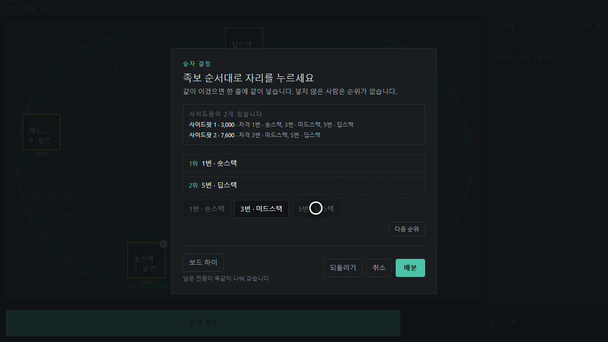

> **층마다 가져갈 수 있는 사람이 다르다** — 1층은 셋 다, 2층은 둘만이다. 몇
> 층인지와 누가 자격자인지는 시스템이 정하고, 딜러는 그것을 보고 순서를 찍는다.

### 되돌릴 수 없는 일은 마지막에

카드가 실물이라 **잘못 나간 지급을 되돌릴 근거가 테이블 위에 남지 않는다.**

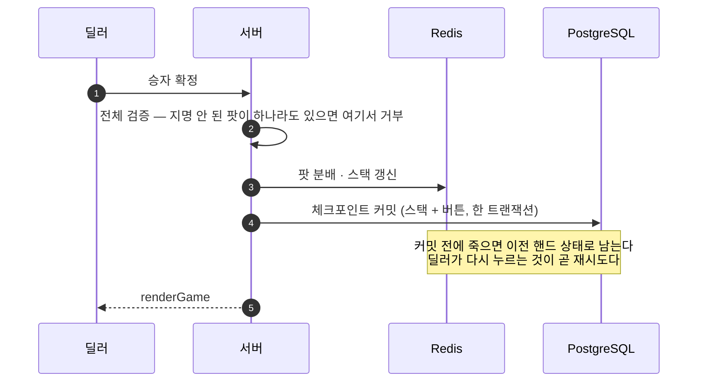
```mermaid
sequenceDiagram
    autonumber
    participant D as 딜러
    participant S as 서버
    participant R as Redis
    participant DB as PostgreSQL

    D->>S: 승자 확정
    S->>S: 전체 검증 — 지명 안 된 팟이 하나라도 있으면 여기서 거부
    S->>R: 팟 분배 · 스택 갱신
    S->>DB: 체크포인트 커밋 (스택 + 버튼, 한 트랜잭션)
    Note over R,DB: 커밋 전에 죽으면 이전 핸드 상태로 남는다<br/>딜러가 다시 누르는 것이 곧 재시도다
    S-->>D: renderGame
```

**되돌릴 수 있는 일을 먼저 하고, 커밋 한 번이 "그 일이 일어난 단일 순간"이 되게
한다.** 같은 형태를 네 경계에서 반복한다 — 핸드 종료(Redis 정산 → DB 체크포인트),
대회 시작(Redis 준비 → DB `ONGOING`), 대회 종료(상금 정산 확인 → 테이블·Redis
삭제), 팟 분배(전체 검증 → 칩 이동).

### 블라인드 레벨은 시각에서 파생된다

저장된 레벨이 아니라 **`startedAt`과 현재 시각이 진실이다.** 조회할 때마다 다시
계산한다.

행사장에서 몇 시간 도는 대회라 서버 재기동과 폴링 지연이 실제로 일어난다. 파생으로
두면 재기동해도 레벨이 되돌아가지 않고, 밀리면 여러 칸을 한 번에 건너뛴다. 리바인
마감도 "그 레벨을 밟았는가"가 아니라 **"지났는가"**로 판정한다. 건너뛴 대회가
영영 열려 있으면 안 된다.

### 서버가 죽어도 대회는 계속된다

온라인이면 서버가 죽은 시간도 게임 시간이다. 오프라인은 아니다 — **서버가 멎은
동안 대회는 진짜로 돌지 않았다.** 그래서 복구는 무슨 장애였는지 추측하지 않고
**지금 무엇이 없는지**만 본다.

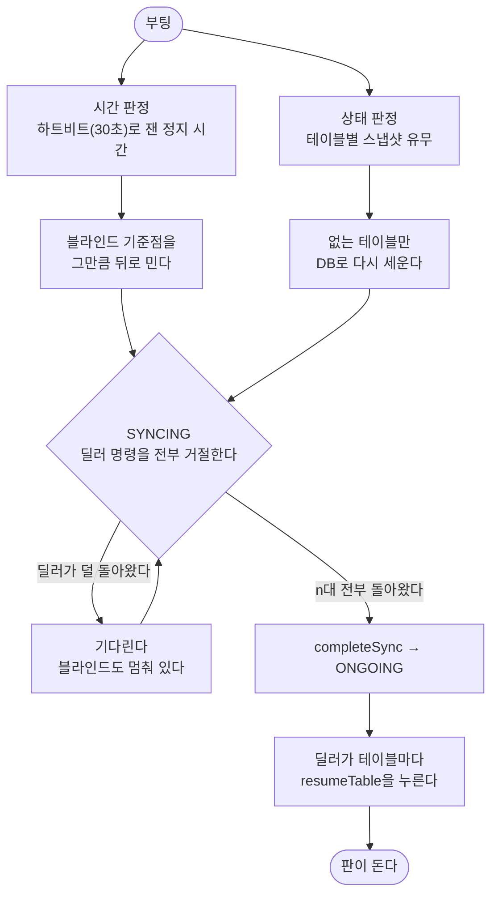
```mermaid
flowchart TD
    boot([부팅]) --> time["시간 판정<br/>하트비트(30초)로 잰 정지 시간"]
    boot --> state["상태 판정<br/>테이블별 스냅샷 유무"]
    time --> push["블라인드 기준점을<br/>그만큼 뒤로 민다"]
    state --> rebuild["없는 테이블만<br/>DB로 다시 세운다"]
    push --> sync
    rebuild --> sync{"SYNCING<br/>딜러 명령을 전부 거절한다"}
    sync -->|"딜러가 덜 돌아왔다"| wait["기다린다<br/>블라인드도 멈춰 있다"]
    wait --> sync
    sync -->|"n대 전부 돌아왔다"| done["completeSync → ONGOING"]
    done --> resume["딜러가 테이블마다<br/>resumeTable을 누른다"]
    resume --> live([판이 돈다])
```

- **`startedAt`이 둘이다.** DB의 `Tournament.startedAt`은 대회가 실제로 시작한
  시각이라 **절대 밀지 않고**, Redis의 `BlindField.startedAt`만 민다. t=0에 둘이
  같은 것은 우연이지 불변식이 아니다.
- **`buttonUser`만 DB에서 파생되지 않는다.** 좌석·스택은 DB에 있고 팟과 차례는
  핸드 경계에서 정당하게 0인데, 버튼은 **"직전 핸드가 어디였나"라 역사의
  함수다.** 그래서 체크포인트가 스택과 버튼을 한 트랜잭션으로 쓴다.
- **부팅은 정지의 끝이 아니다.** 프로세스가 떠도 태블릿이 돌아와야 판이 돈다.
  `SYNCING` 동안 딜러 명령을 전부 막는 것은, 핸드 시작이 깜깜한 좌석을 판에
  넣고 승자 입력이 리바인 창을 꺼진 태블릿으로 보내기 때문이다.
- **n/n이 차도 판은 자동으로 열리지 않는다.** 여는 것은 테이블마다 딜러가 누르는
  재개다. 시스템은 준비까지 하고, 시작은 눈앞을 보는 사람이 한다.
- **소켓이 없는 면도 같은 사실을 읽어야 한다.** 폰과 전광판은 REST라
  브로드캐스트가 닿지 않는다. 그래서 정지는 스냅샷(`resumePending`)과 대회
  상태(`SYNCING`) **양쪽에** 있다 — 한쪽만 두면 사람만 모르는 정지가 된다.

세부 규칙(`status === SYNCING` ⇔ `pausedAt !== null`, 복구 중 재차 정지, 딜러
기기 교체)은 [`domain.md`](./docs/domain.md)에 있다.

### 탈락과 킥은 다르다

플레이어가 물리적으로 그 자리에 앉아 있기 때문에 생기는 구분이다.

| | 자리 | 칩 | 조작 |
|---|---|---|---|
| **탈락** (스택 0) | 비운다 | 남길 칩이 없다 | — |
| **킥** (딜러가 내보냄) | **남는다** | 앤티·블라인드로 서서히 녹는다 | 무엇을 눌러도 폴드 |

킥된 사람의 칩을 즉시 회수하지 않는 이유는 그 칩이 어디로 갔는지 설명할 수 없기
때문이다. 테이블에 남은 사람들이 가져간다. 조작을 막는 방법이 연결 차단이 아니라
**액션을 폴드로 치환**인 이유는 위의 신뢰 경계 때문이다. 끊어도 같은 망에서 다시
붙을 수 있다.

자리를 잃는 길이 하나 더 있다 — **상점이 좌석을 푸는 것**이다. 셋 다 태블릿에는
「내 자리가 없어졌다」로 똑같이 오는데 사람에게 일어난 일은 정반대다. 탈락은 대회가
끝난 것이고, 좌석 해제는 **칩을 든 채 다른 자리로 걸어가는 것**이다. 서버는 어느
쪽인지 말해 주지 않으므로 화면이 **리바인을 물어본 적이 있는지**로 가르고, 사유를
갈라 적는다. 등수는 태블릿이 아니라 폰에 남는다 — 그 기기는 다음 사람이 앉을
자리다. 짝: [`elimination-rebuy.int-spec.ts`](./backend/src/scenario/elimination-rebuy.int-spec.ts)

### 대회가 닫히면 단말이 먼저 안다

대회를 닫는 네 경로는 테이블·딜러 세션·Redis 스냅샷을 함께 지운다. 그 사실을
소켓에 안 쓰던 때는 딜러 화면이 끝난 대회의 마지막 스냅샷을 계속 그렸고, 「핸드
시작」을 누르면 **「명령이 거절되었습니다」**만 떴다 — 끝났다는 사실이 아니라
정체불명의 에러다.

그래서 닫는 순간 좌석·딜러 태블릿을 덮는다. **버튼 비활성으로는 부족하다** —
회색 버튼은 「지금은 차례가 아니다」와 같은 모양이라 이유가 어디에도 안 적힌다.
덮개는 종료와 중단을 갈라 적고, 딜러에게는 딜러가 할 일만 남긴다. 순위와 상금은
사람에게 붙는 정보라 폰이 든다.

### 테이블을 합치는 것은 사람이 걸어가는 일이다

온라인이면 서버가 좌석을 재배치하고 끝이다. 여기서는 **사람이 칩을 들고
일어나 다른 테이블로 걸어간다.** 그래서 이 흐름은 자동화의 대상이 아니라
세 걸음으로 나뉜다 — 상점이 좌석을 해제하고, 사람이 걸어가 **참가 OTP를
다시 넣고**, 상점이 빈 테이블을 닫는다.

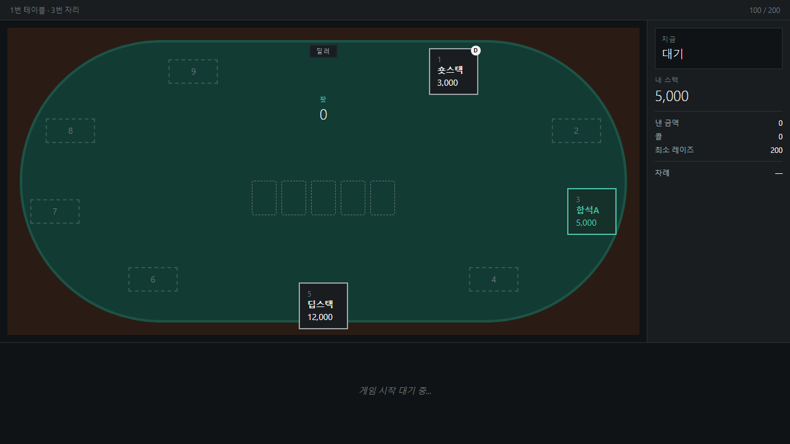

> 걸어온 사람이 다시 앉은 뒤. 자리는 **2번 테이블 어딘가에서 1번 테이블
> 3번**으로 바뀌었는데 **스택 5,000은 그대로다** — 좌석 행이 사라졌다 새로
> 생기는 동안 칩은 참가 행에 있었다(§5). 다른 두 자리가 3,000과 12,000인 것은
> 그 사이 이 테이블에서 판이 돌았기 때문이다.

**언제 누구를 어디로 보낼지는 규칙이 아니라 현장 판단이다.** 그래서 자동
밸런싱을 만들지 않았다(§7) — 시스템이 책임지는 것은 **칩이 좌석보다 오래
사는 것**뿐이다.

### 상금은 상점이 정하고 관리자가 닫는다

프라이즈풀은 걷은 총액(`totalBuyinAmount` — 참가비 + 리바인 누적)에서 상점
몫(`rakePercent`)을 한 번 뗀 나머지다. **건당 떼지 않는다** — 내림이 한 번뿐이라야
`걷은 것 == 상금 + 상점 몫`이 정확히 떨어진다.

**분배율은 저장된 값이 아니라 표에서 파생된다.** 대회가 드는 것은 구간표
(`payoutTable`)이고, 등수별 금액도 상금권 인원도 **엔트리 수**로 구간을 골라
매번 다시 계산한다. 분모가 사람 수가 아니라 엔트리 수인 것은 홀덤 구조표가
그렇게 적히기 때문이고("X entries → Y places paid"), 프라이즈풀 자체가
`엔트리 × 참가비`라 사람 수로 나누면 **분모가 둘이 된다.** 리바인이 많은
대회일수록 둘이 벌어진다.

지급은 `awardPrize` 한 곳에서만 일어나고, 참가자 행·포인트·거래 내역이 한
트랜잭션에서 함께 움직인다.

**대회는 정산이 끝나야 닫힌다.** 닫으면 테이블·딜러 세션·Redis가 지워져 누가 몇
등이었는지 재구성할 수 없다. 게이트가 보는 것은 **합**뿐이고
**분배율대로인지는 묻지 않는다.**

```
걷은 참가비 == 나간 상금 + 환불 + 상점 몫
```

끝나는 길이 넷인데 등식은 이 하나다.

| 길 | 언제 | 무엇을 한다 |
|---|---|---|
| **취소** | 시작 전 | 걷은 것이 없다. 참가비를 그대로 돌려준다 |
| **종료** | 최후 1인 | 상금이 다 나간 뒤 나머지를 상점 몫으로 |
| **ICM 마무리** | 파이널 테이블 | 남은 상금을 **지금 칩 비율**로 나눈다. 이미 나간 상금은 다시 안 나눈다 |
| **중단** | 천재지변 | 진행 중은 낸 돈 전부, 탈락은 절반. 남는 것이 상점 몫 |

ICM이 파이널 테이블에서만 열리는 것은 판정이 `!isRegistrationOpen && tableCount == 1`
이라서다. 등록이 열려 있는 동안에는 사람이 더 들어올 수 있으니 나눌 대상이
확정되지 않는다.

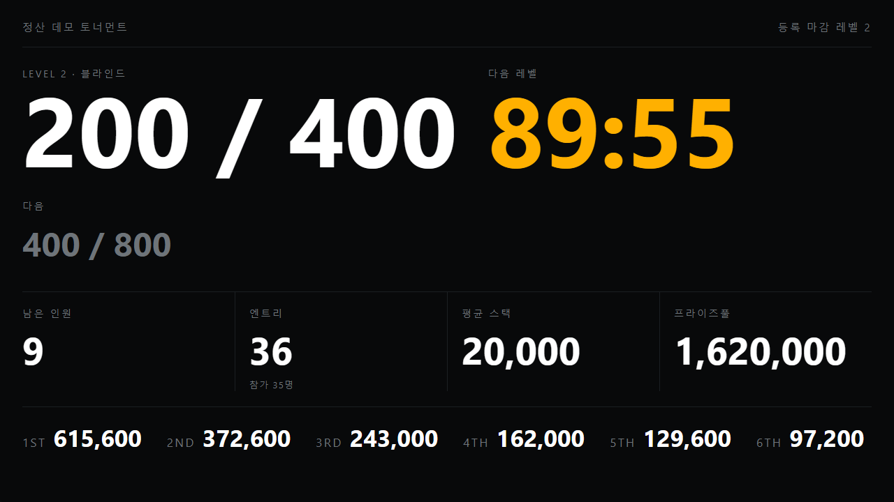

> **등록이 마감되는 순간** 상금표의 금액이 예상에서 확정으로 바뀐다. 마감 전에는
> 사람이 더 들어올 수 있어 구간이 흔들린다.

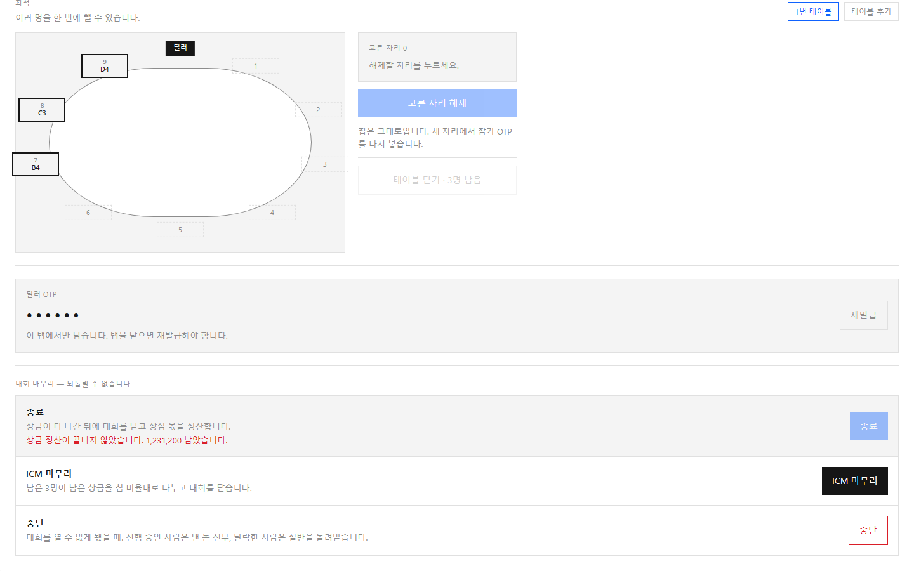

> 종료는 조건이 서기 전까지 **막히고, 왜 막혔는지가 적힌다.** 되돌릴 수 없는
> 일이라 버튼을 회색으로 두는 것으로는 부족하다.

<table>
<tr>
<td width="33%"></td>
<td width="33%"></td>
<td width="34%">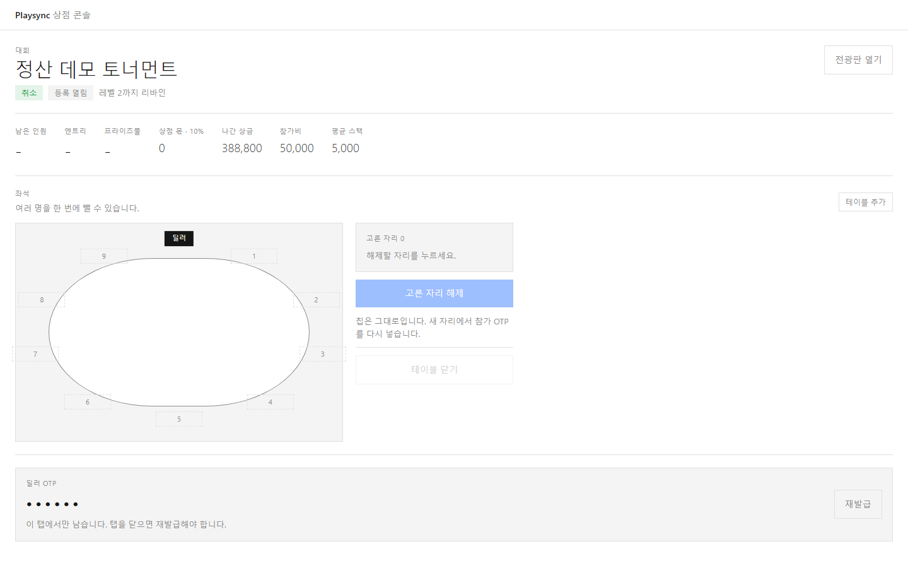</td>
</tr>
</table>

> 같은 무대를 세 문으로 각각 닫은 결과다 — 완주 · 합의 · 중단. **금액은 셋 다
> 다른데 등식은 하나다.** 중단만 상점 몫이 0인 것은 걷은 것을 전부 돌려주기
> 때문이다. 짝: [`icm-chop.int-spec.ts`](./backend/src/scenario/icm-chop.int-spec.ts) · [`abort-settlement.int-spec.ts`](./backend/src/scenario/abort-settlement.int-spec.ts) · [`closed-tournament.int-spec.ts`](./backend/src/scenario/closed-tournament.int-spec.ts)

---

## 2. 무엇이 달라졌나 — V1 → V2

V1은 혼자 짜고 혼자 눌러보며 완성한 MVP다. V2는 같은 코드를 대상으로
**AI가 리뷰하고, AI가 고치고, 사람이 도메인 판단과 순서를 쥐는** 방식으로 다시
지었다.

| | V1 | V2 |
|---|---|---|
| 검증 | 크롬 창 6개 띄워 손으로 눌러보기 | 단위 407 / 통합 644(시나리오 21 스위트 포함) / e2e 13. 실제 Redis·PostgreSQL 컨테이너 |
| 테스트 코드 | `nest g` 스캐폴드 18개. 전부 `toBeDefined`고 경로를 못 잡아 import에서 죽고 있었다 | 버그마다 실패하는 테스트를 먼저 쓴다(TDD) |
| CI | 없음 | 타입 체크 · 테스트 · 빌드 (`.github/workflows/ci.yml`) |
| 코드 리뷰 | 없음 (1인 개발) | `backend/src` 전수 리뷰 → [`review.md`](./docs/review.md) → 27개 발견 |
| 완료 기준 | 해피패스가 돈다 | 악의적 입력·동시 요청·예외 상황에서도 장부가 맞는다 |
| 기록 | 구현 범위 ✅/🚧 목록 | 발견 대장 · 티켓별 판단 근거 · **결정 로그** |

1단계는 **이틀 · PR 20개 · 티켓 21개**, 2단계가 **T22–T36**이다. 그 뒤로 부하
측정(T37–T55)과 전수검사가 찾은 결함(T58– )이 이어졌다.

### V1이 "완료"라고 적은 것들

V1 README는 구현 범위를 ✅ 완료로 적었다. V2가 한 일은 그 목록을 실제로 검증한
것이고, 결과는 **"완료"의 정의가 바뀐 것**이다. 돌아가는 것은 사실이었다 — 다만
**"정상적인 유저가 정상적인 입력을 보낸다"**는 가정 위에서만.

| | 실제로는 | 고친 것 |
|---|---|---|
| **돈·권한** | 음수 레이즈로 칩이 생성됐다. 클라이언트가 서버 내부용 액션을 보낼 수 있었다. 딜러 토큰의 `tableId`를 대조하지 않아 A테이블 딜러가 B테이블을 조작할 수 있었다 | 입력 검증, contract 스키마를 인바운드 화이트리스트로, 게이트웨이에서 권한 대조 |
| **동시성** | 상태 `읽기 → 수정 → 쓰기`가 락 없이 네 곳에서 돌았다(lost update) | Redis 테이블 락. 딜러와 플레이어가 같은 상태를 동시에 만지는 도메인이라 예외가 아니라 기본 시나리오였다 |
| **게임 멈춤** | 타임아웃된 플레이어를 기다리며 라운드가 안 끝났다. 전원 올인이면 페이즈를 넘길 주체가 없었다. 헤즈업 블라인드가 잘못 배치됐다 | 라운드 종료 판정, 딜러 개입(폴드·킥) 경로 수정 |
| **장부** | 사이드팟에서 칩이 증발했다. 롤백된 트랜잭션이 좌석만 남겼다. 대회 시작이 Redis 준비 전에 DB를 커밋했다 | `sum(sidePots) === pot` 보장, 되돌릴 수 없는 일을 마지막으로(§1) |
| **상금** | 금액이 상수였고, 더 큰 것 — **`PRIZE` 거래를 쓰는 코드가 0이라 기록만 되고 실제로 나가지 않았다** | 프라이즈풀에서 파생, 지급을 `awardPrize` 한 곳으로, 정산이 끝나야 닫히는 게이트 |
| **복구** | "Redis Persistence로 상태 복구 **보장**"이라 적혀 있었으나, 읽어서 되살리는 경로가 없었다 | 하트비트로 정지 시간을 재고, 없는 테이블만 DB로 다시 세운다(§1) |

**락을 두 번째로 깔았다.** 나머지 티켓이 상태를 만지는 동안 lost update가 살아
있으면, 버그의 원인이 내 수정인지 레이스인지 구분할 수 없다.

발견 대장은 [`docs/fixlist.md`](./docs/fixlist.md), 티켓별 판단 근거는
[`docs/tickets.md`](./docs/tickets.md).

### 얼마나 받나

**1코어 512MB에 12,420명이 들어갔다.** 배포 설정 한 줄을 넣고서다 — 그 줄이
없으면 11,790명에서 서버가 스스로 죽는다.

| 1,380테이블 · 12,420명 전원 착석 | |
|---|---|
| 무대 | `cpus: 1` · `mem_limit: 512m`. 클라우드에서 가장 싼 등급(AWS `t4g.nano`, GCP `e2-micro` 언저리) |
| 고원 | 내 액션 p95 221ms · 서버 lag 중앙 2.34ms · CPU 51.6% · rss 449MB |

**정원을 깎고 있던 것은 인스턴스가 아니라 기본 힙 상한이었다.** 11,790명에서
백엔드가 `ExitCode 134`로 죽었는데 **`OOMKilled=false`였다.** 컨테이너 512MB에
114MB가 남아 있었다 — 커널이 죽인 것이 아니라 **V8이 자기 힙 상한에 부딪혀 스스로
abort**했다. 노드가 cgroup 512MB를 보고 `heap_size_limit`을 259MB로 잡아 둔 것이다.

```yaml
NODE_OPTIONS: --max-old-space-size=340   # 259 → 343MB
```

**11,790 → 12,420명.** 인스턴스 크기도 CPU 스펙도 바꾸지 않았다. 340인 것은
`rss = 힙 + 소켓·버퍼`이고 힙 밖이 약 140MB라, 컨테이너 한도까지 올리면 이번에는
커널이 죽이기 때문이다.

**정원의 축이 둘로 갈린다 — 문 앞과 게임 안.** 12,420명을 물린 채 고원에서 코어만
떨궜다(소켓은 끊지 않는다).

| 코어 | 서버 lag p95 | rss |
|---|---|---|
| 12코어 | 0.92ms | 433MB |
| **1코어** | **0.72ms** | 451MB |

**12분의 1로 줄여도 지연이 변하지 않는다.** 게임 진행은 JS 스레드 하나가 하는
일이고, 라이브 속도(시간당 27핸드)로 흩어져 오는 액션에는 그 스레드가 놀고 있다.

비싼 쪽은 **문 앞**이다. 테이블 하나를 세우는 비용의 **71%가 bcrypt**다(737ms 중
523ms · 로그인 한 번당 약 52ms). 그리고 **그 병렬도는 코어 수가 아니라 libuv
스레드풀이 정한다** — `UV_THREADPOOL_SIZE`가 기본 4라, 12코어를 줘도 착석 구간
CPU가 3.7코어에서 멈췄다.

**그래서 문 앞에 줄을 세운다.** 로그인의 제품 기본 상한은 분당 120이고, **첫 429가
121번째 요청**에서 나온다. 그 순간 **그 키가 통째로 닫힌다**(30초) — 「121번째
사람이 잠깐 기다린다」가 아니다.

| 들어오는 속도 | |
|---|---|
| 초당 5명 | 편안하다 (CPU 73%, 내 액션 65ms) |
| 초당 9–10명 | 4분 만에 **불편선**을 넘는다 |
| 초당 40명 | 300테이블 부근에서 무너진다 |

2,160명을 채우는 데 7분, 10,800명이면 30분이다. **동시접속이 아니라 도착이
정원을 정한다.**

> **이 수치를 믿을 때의 단서.** 12,420명 실행은 **리바인이 0**이다 — 22분에
> 테이블당 3핸드라 아무도 파산하지 않았고 탈락·사이드팟·리바인 갈래가 통째로 안
> 돌았다. **소켓과 액션 브로드캐스트의 정원이지 대회 전 구간의 정원이 아니다.**
> 1코어에서 내 액션 p95가 1,061ms로 중단됐는데 같은 시각 서버 lag은 중앙
> 2.34ms · CPU 51.6%였다 — **서버가 포화한 것이 아니고**, 원인은 아직 안 갈랐다.
> 위 도착률 표는 그보다 앞선 실행이라 중단 조건이 몰림 스파이크를 한계로 잡던
> 때의 값이다.
>
> 전체 기록 — [`08-15 램프`](./docs/results/2026-08-15-load-ramp.md) ·
> [`08-17 고원`](./docs/results/2026-08-17-load-ceiling.md) ·
> [`08-21 12,000명`](./docs/results/2026-08-21-load-12k.md) ·
> [`09-10 문`](./docs/results/2026-09-10-door-limit.md) ·
> [`09-11 bcrypt의 몫`](./docs/results/2026-09-11-bcrypt-share.md)

---

## 3. AI를 어떻게 썼나

**공부하려고 시작했다.** 에이전트 코딩으로 기존 프로젝트를 고쳐 보는 첫
시도였고, 예상은 "AI가 짜고 나는 읽으면서 배운다"였다.

**도구가 예상보다 강했다.** 오류를 찾고, 찾은 것을 적용 전에 다시 대조하고,
판단을 문서로 남기고, 실행 순서를 잡는 일까지 스킬로 돈다. 거기에 TDD · 스펙
주도 · 서브에이전트 주도 개발을 얹으니 **반자율로 굴러갔다.** 코드를 줄
단위로 읽지 않는다 — 읽으려 들면 진행이 멈춘다.

### 판단이 갈린 자리

AI는 코드를 읽지만 **왜 그렇게 짰는지**는 모른다. 스킬도 이 도메인이 무엇인지는
모른다. 그 자리는 대체되지 않았고, 갈린 자리마다 원문이 결정 로그에 남아 있다.

- **승인한 설계를 되물어 철회시켰다** — AI의 "Redis 좌석 비트맵 지연 생성"안을
  일단 승인했다가, 「에러 복구는 이 티켓들 다 쳐내고 해야 하는 것 아니었나」로
  되돌렸다. 유실 복구는 별도 티켓으로 갔다. **범위가 새는 것을 막은 자리다.**
  ([chat-log2](./docs/chat-log2.md) #38)
- **AI 진단을 두 번 정정했다** — AI는 "소켓마다 직렬화하는 코드는 지금 없다"고
  두 번 반박했다. 병목은 직렬화가 아니라 **같은 문자열을 소켓 수만큼 밀어내는
  fan-out**이었고, 그 방향으로 다시 뒤지자 최악 지점이 게임 중이 아니라 **등록
  구간**(착석 한 명마다 O(테이블²))이라는 것이 드러났다.
  ([chat-log3](./docs/chat-log3.md) #3)
- **테스트 훅이 아니라 제품 코드를 고치게 했다** — AI 제안은 제품 코드를 한 줄도
  안 고치고 테스트가 락을 먼저 쥐는 방식이었다. **"앉는 동시에 액션이 나온다"**를
  짚자 티켓 성격이 바뀌었고, 스냅샷을 고치는 경로 11곳이 구조가 아니라 관행으로만
  지켜지고 있다는 것이 함께 나왔다. ([chat-log3](./docs/chat-log3.md) #10)
- **없는 기능을 만들 뻔했다** — 리뷰가 `forceNextPhase` 버튼을 새로 만들라고
  적었는데, 자리를 비운 사람을 처리하는 수단은 `DEALER_FOLD`·`DEALER_KICK`으로
  이미 있었다. **AI는 그 두 액션이 무엇을 하는 것인지 몰랐다.** 티켓이 신규
  기능에서 버그 수정으로 바뀌며 프론트 변경도 사라졌다.
  ([chat-log](./docs/chat-log.md) #21)
- **"버그가 아니다"를 판정했다** — `createSession`이 아무것도 반환하지 않는 것을
  AI가 결함으로 올렸으나 설계였다. 발견을 철회시켰다.
  ([chat-log](./docs/chat-log.md) #30)
- **엔드포인트를 안 만들었다** — 보드 하이(무승부)에 서버 경로를 따로 두자는
  안을 접었다. 딜러 콘솔이 생존 전원을 한 그룹으로 채워 보내면 된다 — **돈이
  나가는 경로는 하나여야 한다.** ([chat-log](./docs/chat-log.md) #34)

도구를 **어디에 어떻게 걸지**도 사람이 정했다 — 무엇을 병렬로 돌리고 무엇을
대화로 끌지, 리뷰에 얼마를 쓸지.

판단 과정은 [`docs/chat-log.md`](./docs/chat-log.md)(1단계 T1–T21)와
[`docs/chat-log2.md`](./docs/chat-log2.md)(2단계 T22–T36),
[`docs/chat-log3.md`](./docs/chat-log3.md)(3단계 T37–T55),
[`docs/chat-log4.md`](./docs/chat-log4.md)(4단계 T58–T86)에 남아 있다. 각 항목은
**요청 → AI 제안 → 사람 판단 → 근거 → 결과** 형식이고, **기각되거나 철회된 AI
제안도 그대로 남겼다.** 누가 정했는지도 갈라 적는다 — 워크트리 위임의 세부
제약은 "AI가 정한 위임 세부사항"이라고 적혀 있다.

### 도구가 쥔 것 — 절차

빨간불 먼저 · 적용 전 재대조 · 완료 주장 전 실행. 이 절차들은 여기서 발명한
것이 아니라 스킬이 갖고 온 것이다. 값을 한 자리 둘.

- **특성화 테스트에 "기대값을 코드에서 역산하지 말고 홀덤 규칙으로 먼저
  계산하라"는 제약이 걸렸다.** 코드를 돌려 나온 값을 그대로 적으면 버그까지
  정답으로 굳는다. 18건 중 1건이 어긋났고 그게 사이드팟 칩 증발 버그였다.
- **전수 리뷰 18건을 적용 전에 코드와 다시 대조했다.** 15건은 정확했고 오진
  3건이 걸러졌으며, 대조 과정에서 신규 9건이 더 나왔다(합 27건). 걸러진
  `P1-3`은 **제안한 수정 자체에 역효과 버그가 있었다** — 그대로 적용하면
  타임아웃 타이머를 유실시켜 데드락이 다른 경로로 재발한다.

---

## 4. 테스트

세 계층이고, 각각 다른 종류의 버그를 잡는다.

| | 파일 | 인프라 | 잡는 것 |
|---|---|---|---|
| 단위 | `*.spec.ts` | 없음 | 엔진 같은 순수 로직. 빨라야 TDD 루프가 돈다 |
| 통합 | `*.int-spec.ts` | Redis + PostgreSQL | 락·트랜잭션처럼 **진짜 인프라라야 의미 있는 것** |
| 시나리오 | `scenario/*.int-spec.ts` | 위와 같음 | **이음매**. 부품이 각각 옳은데 조립이 틀린 경우 |

락을 mock으로 테스트하면 검증 대상인 원자성 자체가 사라진다. 그래서 통합 테스트는
개발용과 분리된 진짜 Redis·PostgreSQL 컨테이너를 띄운다.

```
contract       82  (7 suites)      백엔드 단위   407  (38 suites)
프론트 단위   273  (36 files)      통합         644  (40 suites · 시나리오 21 포함)
e2e            13  (4 files)       부하 하네스    39  (3 files)
                                   + 데모 촬영 1 · 정산 촬영 3
```

1단계를 닫은 시점이 contract 44 / 단위 122 / 통합 199였다. 늘어난 것은 전부
**티켓마다 쌓은 회귀 테스트**다.

**측정기에도 테스트를 붙였다.** 부하 하네스(`load/`)는 제품 코드가 아닌데, 짝짓기
로직이 클로저 안에 있는 동안 검증할 길이 실행 요약을 사람이 읽는 것뿐이었다 —
12,000명 실측에서 **235배 틀린 값**을 내고도 아무도 못 잡았다. 순수 모듈로 빼면서
그 길을 만들었다. 워크스페이스가 아니라 루트 `npm test`에 없다
(`cd load && npm test`).

**새 테스트가 처음부터 통과하면 의심한다.** 네 번 데인 뒤로 그렇게 한다 — 그중
하나는 검사 둘이 서로를 가린 경우였고, 둘이 일치하는 입력만 먹였더니 하나를
통째로 지워도 전부 초록이었다.

### 화면까지 세우고 나서 드러난 것

프론트 단위 테스트의 목(mock)은 **백엔드를 병렬로 만들던 시절의 도구**였다.
백엔드가 다 선 뒤로는 목이 틀려도 그 사실을 알려주는 것이 없다. 그래서 봉투
모양·키 이름·상태 전이는 목이 아니라 **e2e가 진짜 백엔드로 판정한다**
([`frontend/e2e/`](./frontend/e2e/)).

그러고도 세 계층이 전부 초록인데 화면만 틀린 결함이 나왔다 — **좌석 해제·착석·
대회 시작이 Redis 스냅샷은 고쳐 놓고 그 테이블 화면에는 알리지 않았다.** 셋 다
같은 착각이었다(좌석 현황 신호는 아직 안 앉은 사람의 대기 화면용이다). 값은
맞고 화면만 틀린 것이라 데모를 찍기 전에는 아무도 몰랐다.

### 촬영이 곧 회귀 테스트다

[`frontend/e2e/`](./frontend/e2e/)는 프로젝트가 셋이다 — `regression` ·
`demo` · `settlement`. **뒤 둘은 README에 걸 그림을 만드는 자리이면서 동시에
회귀 계층이다.**
장면마다 짝이 되는 시나리오 테스트를 두고, 그 테스트가 단계마다 검사하는
불변식이 화면에서 눈으로 확인되게 짰다 — 돌아가는 것은 V1이 이미 보였으니
화면이 증명할 것은 **"정합이 무너지지 않는다"** 쪽이다.

값이 아니라 화면을 보는 계층이라 잡는 것도 다르다. 넷 나왔다.

| | 무엇이었나 |
|---|---|
| **거절이 화면에 아무것도 남기지 않는다** | 서버는 실패를 브로드캐스트하지 않고 누른 사람에게 ack로만 돌려주는데, 딜러 화면이 `renderGame`만 읽고 있었다. 승자 결정 거절은 **상태가 그대로**라 화면이 그대로다 — 딜러는 먹은 줄 안다 |
| **거절 문구에 uuid가 둘 떴다** | 자격자를 `userId`로 이어 붙였다. 딜러가 보는 것은 눈앞의 테이블이라 자리 번호 + 닉네임으로 바꿨다 |
| **딜러 화면 머리글이 테이블 uuid였다** | uuid를 좌석 태블릿에서만 걷어냈던 것이다. 번호를 못 구하면 **uuid로 되돌아가지 않고** 테이블 쪽을 뺀다 |
| **진행 중 탈락한 사람의 폰에 순위가 없었다** | `/me`가 **대회 상태**로만 갈랐다. 탈락은 대회가 끝나기 훨씬 전에 일어나니 가르는 기준은 "이 사람의 참가가 끝났는가"다 |

앞의 셋은 결국 하나다 — **막는 것과 알려주는 것은 다르다.** 장부는 이미
지켜지고 있었고(§1), 그 사실이 딜러에게 도달하지 않았을 뿐이다. 값을 보는
계층은 통과시킬 수밖에 없다.

### 시나리오 계층이 왜 따로 필요한가

단위·통합 테스트는 부품을 본다. 그런데 실제로 터진 버그 중에는 **두 함수가 각각
옳은데 순서만 틀린** 것이 있었다(대회 시작이 Redis 준비 전에 DB를 커밋했다).
어느 부품 테스트도 이걸 잡지 못한다.

시나리오는 단계마다 도메인 불변식을 검사한다. 마지막에 한 번만 보면 "어딘가에서
칩이 사라졌다"까지만 알 수 있어서 **틀어진 첫 순간**을 잡도록 만들었다.

```
칩 총량 보존 / 사이드팟 합 == 팟 / 폴드한 사람은 자격 없음
쇼다운에는 차례 없음 / 좌석 비트맵 == 스냅샷
```

| 시나리오 | 무엇 |
|---|---|
| `full-tournament` | 대회 하나를 끝까지 |
| `dealer-intervention` | 딜러 폴드·킥 |
| `allin-sidepot` | 올인, 사이드팟, 승자 결정 페이즈의 정보 정확도 |
| `elimination-rebuy` | 탈락과 리바인 |
| `timeout` | 제한 시간, 낡은 타이머 |
| `blind-and-prize` | 블라인드 상승 → 등록 마감 → 상금 지급 |
| `board-high` | 동점 분배 |
| `server-recovery` | **부분 유실.** 한 테이블만 스냅샷을 잃은 채 정지 시간 보정이 겹친다(§1) |
| `table-move` | 좌석 해제 → 걸어가서 참가 OTP로 재착석 |
| `table-autocreate` | 일곱이 앉아도 테이블은 늘지 않는다 — 여는 것은 상점이다 |
| `full-flow` | **회원가입부터 대회 마무리까지.** 스텁 없이 WS 경유 |


---

## 5. 구조

npm workspaces 모노레포.

| 워크스페이스 | 역할 |
|---|---|
| `backend` | NestJS 11. 게임 로직, WebSocket, DB/Redis |
| `frontend` | Next.js. 면 다섯 — 폰 · 좌석 태블릿 · 딜러 태블릿 · 상점 콘솔 · 전광판 |
| `packages/contract` | 백엔드/프론트가 공유하는 zod 스키마. **경계를 넘는 것만** 정의 |

### 면과 서버

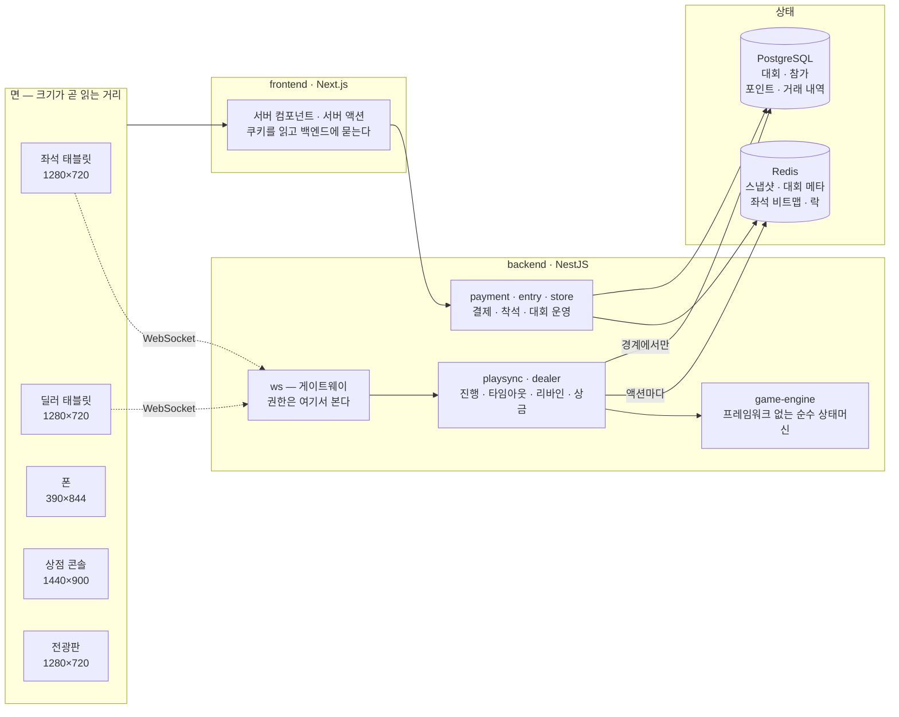
```mermaid
flowchart LR
  subgraph faces["면 — 크기가 곧 읽는 거리"]
    seat["좌석 태블릿<br/>1280×720"]
    dealerT["딜러 태블릿<br/>1280×720"]
    phone["폰<br/>390×844"]
    console["상점 콘솔<br/>1440×900"]
    board["전광판<br/>1280×720"]
  end

  subgraph front["frontend · Next.js"]
    next["서버 컴포넌트 · 서버 액션<br/>쿠키를 읽고 백엔드에 묻는다"]
  end

  subgraph back["backend · NestJS"]
    ws["ws — 게이트웨이<br/>권한은 여기서 본다"]
    play["playsync · dealer<br/>진행 · 타임아웃 · 리바인 · 상금"]
    rest["payment · entry · store<br/>결제 · 착석 · 대회 운영"]
    engine["game-engine<br/>프레임워크 없는 순수 상태머신"]
  end

  subgraph state["상태"]
    redis[("Redis<br/>스냅샷 · 대회 메타<br/>좌석 비트맵 · 락")]
    db[("PostgreSQL<br/>대회 · 참가<br/>포인트 · 거래 내역")]
  end

  faces --> next
  seat -. WebSocket .-> ws
  dealerT -. WebSocket .-> ws
  next --> rest
  ws --> play
  play --> engine
  play -- "액션마다" --> redis
  play -- "경계에서만" --> db
  rest --> redis
  rest --> db
```

> 실선이 HTTP, 점선이 WebSocket이다. 좌석·딜러 태블릿만 소켓을 든다 —
> 나머지 셋은 조회와 조작뿐이라 Next를 거친다. **액션마다 Redis, 경계에서만
> PostgreSQL** — 핸드당 수십 번 일어나는 상태 변경이 DB를 때리지 않는다
> (아래 「상태를 어디에 두는가」). 게임 로직은 `game-engine` 하나에 모여 있고
> 프레임워크 의존성이 없다.

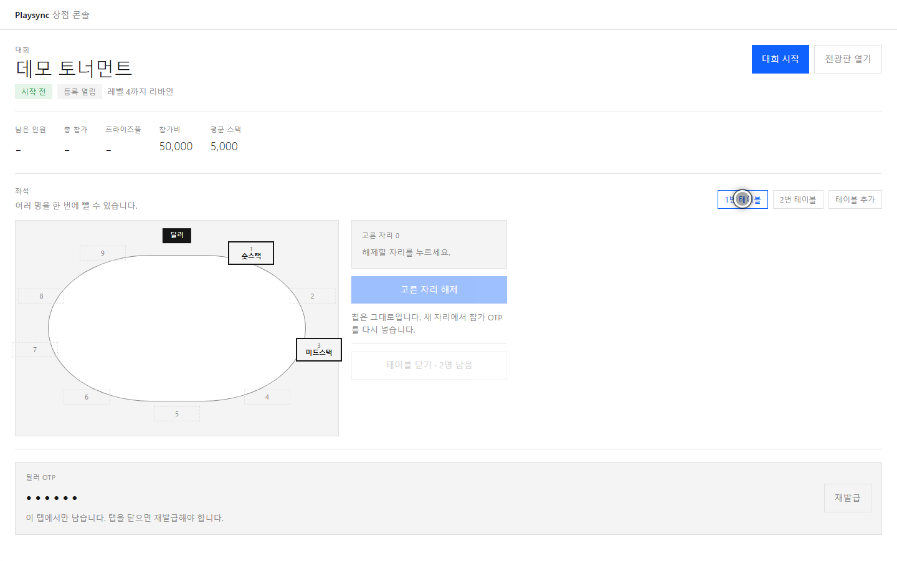

> 소켓을 안 드는 면 중 하나 — **상점 콘솔**이다. 대회 시작 · 좌석 해제 ·
> 테이블 닫기가 전부 서버 액션 한 번씩이라 실시간 채널을 들 이유가 없다.
> 좌석 도식이 곧 조작 대상이고, 테이블 탭이 물리 테이블 번호 그대로다.

### 백엔드 모듈

| 모듈 | 역할 |
|---|---|
| `game-engine` | 프레임워크 의존성이 없는 순수 상태머신. 베팅 라운드, 사이드팟, 페이즈 전환, 팟 분배 |
| `playsync` | 진행 오케스트레이션. 액션 처리, 타임아웃, 리바인, 탈락, 상금, DB 체크포인트 |
| `dealer` | 딜러 OTP 인증, 딜러 명령(핸드 시작, 폴드/킥, 승자 결정, 체크포인트 재시도) |
| `ws` | WebSocket 게이트웨이. 인바운드 경계와 브로드캐스트 |
| `redis` | 상태 스냅샷, 대회 메타, 좌석 비트맵, 유저 컨텍스트, 테이블 락 |
| `payment` · `entry` · `store` · `auth` · `user` | 결제·착석·대회 운영·인증 |
| `scenario` | 여러 이음매를 한 줄로 잇는 시나리오 테스트 (§4) |

### 스키마 — 칩은 좌석보다 오래 산다

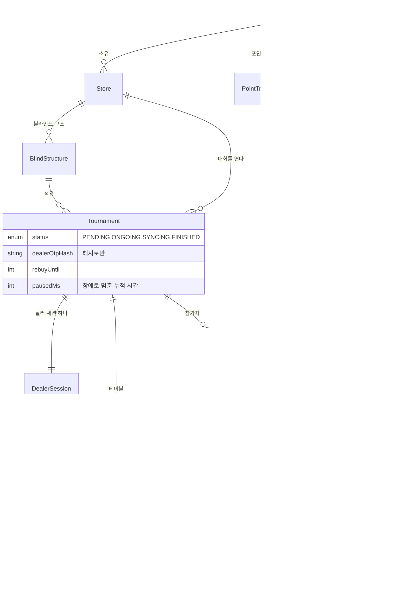
```mermaid
erDiagram
  User ||--o{ Store : "소유"
  User ||--o{ PointTransaction : "포인트 이동"
  User ||--o{ TournamentParticipation : "참가"
  User ||--o{ TablePlayer : "착석"

  Store ||--o{ BlindStructure : "블라인드 구조"
  Store ||--o{ Tournament : "대회를 연다"
  BlindStructure ||--o{ Tournament : "적용"

  Tournament ||--|| DealerSession : "딜러 세션 하나"
  Tournament ||--o{ Table : "테이블"
  Tournament ||--o{ TournamentParticipation : "참가자"
  DealerSession ||--o{ Table : "담당"
  Table ||--o{ TablePlayer : "좌석"

  TournamentParticipation {
    enum   status "WAITING PLAYING ELIMINATED AWARDED"
    int    currentStack "칩 — 좌석이 아니라 여기 산다"
    string playerOtp "평문. 마이페이지가 다시 보여준다"
    int    finalPlace
    int    prizeAmount
    int    buyInCount
  }
  TablePlayer {
    int seatPosition "0~8"
  }
  Table {
    int tableOrder "물리 테이블 번호"
    int buttonUser "지난 핸드의 버튼 좌석"
  }
  Tournament {
    enum   status "PENDING ONGOING SYNCING FINISHED"
    string dealerOtpHash "해시로만"
    int    rebuyUntil
    int    pausedMs "장애로 멈춘 누적 시간"
  }
```

> **`TablePlayer`는 좌석 배치표이고 `TournamentParticipation`이 장부다.**
> 칩(`currentStack`)이 참가 쪽에 있는 이유가 그것이다 — 상점이 좌석을 해제하면
> `TablePlayer` 행이 사라지는데(T29), 칩이 거기 있었을 때는 같이 사라졌다.
> `TableState`(Redis)에는 덱도 홀카드도 없다. §1을 보라.

### 상태를 어디에 두는가

| | Redis | PostgreSQL |
|---|---|---|
| 성격 | 진행 중인 게임의 **작업 사본** | **진실**. 웹이 읽는 것 |
| 쓰기 빈도 | 액션마다 | 경계 이벤트에만 |
| 담는 것 | 테이블 스냅샷, 대회 메타(전광판), 좌석 비트맵, 락 | 대회·참가·좌석·포인트·거래 내역 |

플레이어 액션 경로에 DB 쓰기는 없다. 딜러 킥만 예외다 — 대회 참가 상태를 바꾸는
일이라 그 자리에서 DB를 만진다.

### WebSocket (`/playsync`)

접속은 쿼리스트링의 토큰으로 인증한다.

| 방향 | 이벤트 | 내용 |
|---|---|---|
| → 서버 | `PLAYER_ACTION` | `CHECK` `CALL` `FOLD` `RAISE`(+amount) |
| → 서버 | `DEALER_ACTION` | `START_PRE_FLOP` `RESOLVE_WINNERS` `DEALER_FOLD` `DEALER_KICK` `RETRY_CHECKPOINT` |
| → 서버 | `REBUY_RESPONSE` | 리바인 수락/거절 |
| → 클라 | `renderGame` | 테이블 상태 브로드캐스트 |
| → 클라 | `renderSeatList` | 좌석 현황 (예매 화면) |
| → 클라 | `REBUY_PROMPT` | 리바인 확인 요청 (개별 플레이어) |
| → 클라 | `keepalive` | 아직 붙어 있다는 앱 레벨 신호 (페이로드 없음) |

권한은 스키마가 아니라 게이트웨이가 본다.

- **딜러**: 토큰의 `tableId`와 쿼리의 `tableId`를 대조한다. 대조하지 않으면
  A테이블 딜러가 B테이블의 킥·승자 지정 권한을 그대로 얻는다.
- **플레이어**: 서버가 들고 있는 스냅샷에 그 좌석이 있는지 본다. 클라이언트가
  보낸 값을 근거로 삼지 않는다.
- **Origin**: **필수다**(CSWSH). 헤더가 없는 접속도 거부한다. 예전에는
  통과시켰는데, 그 근거였던 "좌석 태블릿은 브라우저가 아니다"가 사실이 아니었다 —
  좌석·딜러 태블릿 모두 Next 화면이다(T24 · [`threat-model.md`](./docs/threat-model.md)
  관찰 2). 그래서 브라우저를 안 거치는 것(부하 봇 · 촬영의 백스테이지 소켓)이
  오히려 헤더를 손으로 싣는다.

`TIME_OUT`처럼 서버 내부에서만 만들어지는 액션은 **스키마에 없어서** 인바운드로
들어올 수 없다. 스키마가 곧 화이트리스트다.

### 끊긴 것을 어떻게 아는가

**TCP는 케이블이 뽑혀도 끊겼다고 말하지 않는다.** 서버는 주기마다 ping과
`keepalive`를 보내고 응답 없는 소켓을 걷어낸다(`WsGateway.sweepSockets`).
프로토콜 ping만으로 부족한 것은 **브라우저 JS가 ping 프레임을 볼 수 없어서**다 —
서버가 좀비를 치워도 태블릿 쪽에서는 `onclose`가 뜨지 않아 재접속이 영영 시작되지
않는다. 위 표의 `keepalive`가 태블릿이 "아직 붙어 있다"를 확인하는 유일한 근거다.

돌아오는 쪽 규칙은 화면이 아니라 순수 모듈에 있다(`reconnect-policy.ts`).
컴포넌트 안에 두면 **"40초 뒤에 붙는가"를 40초 기다리지 않고 검증할 길이 없다.**

- **지터가 필요한 것은 행사장 전원이 동시에 끊기기 때문이다.** 백오프 없이 바로
  붙으면 그 전원이 같은 순간에 티켓 발급을 친다. 실측으로 660소켓이 기본 상한에
  몰리자 600이 통과하고 60이 막혀 **첫 사람과 마지막 사람의 차이가 31.9초**였다.
  문을 열어 둔 무대에서 같은 660이 2.1초다 — 그 30초는 서버가 아니라 상한이
  만든 시간이다.
- **딜러는 일부러 늦게 붙는다.** 먼저 붙으면 아홉 중 둘만 찬 테이블을 보게 되고,
  사람이 재개를 이르게 누르는 순간이 정확히 거기다. **창을 줄이지 닫지는
  않는다** — 닫는 것은 딜러의 판단이다.
- **코드 1000에는 다시 붙지 않는다.** 대회가 끝나 서버가 정상으로 닫은 것이라,
  다시 붙으면 단말이 끝난 대회에 매달린다. 이 반대 입력이 없으면 "항상
  재접속한다"는 구현도 나머지를 전부 통과한다.

---

## 6. 실행

Node.js와 Docker가 필요하다.

```bash
cd backend && docker compose up -d   # PostgreSQL + Redis + 마이그레이션 + 데모 시드

# 루트에서
npm run dev:backend    # NestJS watch (http://localhost:3001)
npm run dev:frontend   # Next dev     (http://localhost:3000)
npm run test           # 단위 테스트 셋(contract · 백엔드 · 프론트). 인프라 없이 1분
npm run test:int       # 통합 테스트. 컨테이너 기동부터 자동
npm run test:e2e       # 화면 회귀(Playwright). 시드가 먼저다. 개발 서버는 떠 있으면 재사용
npm run demo           # 데모 촬영. 시드 → 프론트 빌드 → 장면 다섯을 한 실행으로
npm run assets         # 촬영본을 자르고 합쳐 img/ 로 (ffmpeg-static)
npm run demo:settlement  # 정산 촬영. 마무리 셋을 각각 시드부터 다시 돈다
npm run assets:settlement  # 정산 촬영을 자른다
```

위 그림 전부가 촬영의 산출물이다 — 장면 다섯이 `npm run demo`, 마무리 셋이
`npm run demo:settlement`다. **마무리는 셋을 따로 돈다** — 하나가 대회를 닫으면
나머지는 찍을 자리가 없어서고, 그래서 매번 시드를 다시 깐다. 촬영은
**프로덕션 빌드**로 돈다 — 개발 서버는 화면마다 개발 표시기를 앉히고 라우트를
처음 열 때마다 흰 화면을 남긴다. 장면 경계는 스펙이 `timeline.json`에 시각으로
남기고, 자르는 것은 `npm run assets`가 한다.

**직접 돌려서 확인하라고 적지 않는 이유가 이것이다.** 이 시스템의 요점은 면
다섯이 같은 판을 동시에 그리는 것인데, 그걸 혼자 보려면 창을 여섯 개 띄우고
폰에서 받은 OTP를 태블릿에 옮겨 적고 딜러 번호를 콘솔에서 꺼내야 한다. 위
그림이 그 자리를 대신한다 — **촬영은 사람이 하는 것을 그대로 하고, 값이
틀어지면 거기서 멈춘다**(§4).

[`seed.ts`](./backend/prisma/seed.ts)가 세우는 것은 **무대까지**다 — 상점 하나에
대회 둘이다. 장면 다섯이 쓰는 일곱 명·테이블 둘짜리와, 마무리 촬영이 쓰는
서른다섯 명·테이블 넷짜리. 둘로 나눈 이유는 규모다 — 종료·ICM·중단은 파이널
테이블에 도달해야 문이 열리는데, 일곱 명짜리에서는 첫 핸드가 곧 파이널
테이블이라 「필드가 줄어든다」가 사라진다. 둘 다 `PENDING`이고 **착석도 대회
시작도 하지 않는다** — 그 둘이 화면에서 보여줄 장면 자체이기 때문이다. **덮어쓰지 않고 지우고
다시 만들므로** 개발 DB의 기존 데이터는 사라진다. 딜러 OTP는 해시로만 저장돼
시드가 stdout에 찍는 값이 유일한 열람 경로다. 자세한 것은
[`frontend/e2e/README.md`](./frontend/e2e/README.md).

`backend/.env`:

```env
DATABASE_URL=postgresql://root:<password>@localhost:5432/playsync
DATABASE_PASSWORD=<password>
JWT_SECRET=<secret>
REDIS_HOST=localhost
REDIS_PORT=6379
REDIS_PASSWORD=<password>
```

`MIN_PLAYERS_TO_START`(6) · `WS_ALLOWED_ORIGINS`(`http://localhost:3000`) ·
`REBUY_TIMEOUT_MS`(15000)은 선택값이다. **기본값이 전부 운영 기준**이라 설정하지
않아도 안전한 쪽으로 동작한다.

프론트는 [`frontend/.env.example`](./frontend/.env.example)을 `.env`로 복사한다.

---

## 7. 지금 없는 것

범위를 자른 기준은 하나였다 — **이 리포가 설명해야 하는 것은 도메인 흐름이
아니라 트랜잭션 격리와 락의 경계다.** 흐름을 하나씩 고치기 시작하면 끝이 없다.
그래서 "곧 붙일 것"과 "일부러 안 한 것"을 구분해 둔다. 전체 목록과 순서는
[`docs/backlog.md`](./docs/backlog.md)(B1–B11)에 있다.

백엔드 완주 항목은 서버 장애 복구(T31)로, 화면은 T34–T36으로 섰다. 그 뒤에
마무리 셋(종료 · 합의 · 중단)과 그 화면이 T79–T86으로 붙었다(위 그림 전부가 그
화면이다). 그다음 T87–T96이 **닫힌 대회가 화면마다 다르게 보이던 것**을 맞추고
(T87–T91), 서버가 멎었다 돌아오는 구간을 세웠다 — 자동 재접속(T93) · 정지 동안
흐른 턴 시계(T94) · 정지와 재개의 표시(T95) · `SYNCING`(T96). 뒤 넷이 §1의
복구 절이다. **README에 들어가지 않을 화면은 그리지 않는다**가 화면
명세의 첫 규칙이었고, 그래서 안 그린 화면 목록도
[`명세`](./docs/superpowers/specs/2026-08-08-readme-demo-design.md)에 남아 있다.

### 안 하기로 한 것

목록이 아니라 **판단**이다. 항목마다의 근거는
[`backlog.md`](./docs/backlog.md) 「하지 않는 것」에 있고, 공통점은 하나다 —
**규칙이 아니라 사람의 결정인 것은 코드가 정할 수 없다.**

> 레이크와 ICM 찹은 **한동안 이 표에 있었다.** 「비율이 들어와도 불변식의 모양은
> 안 바뀐다」가 근거였는데, 그 말이 맞아서 나중에 둘 다 들어올 수 있었다 —
> 레이크는 T80, 마무리 셋은 T79–T86이다. 지금은 상단 ⑥·⑦과 §1의 마무리 표가
> 그 자리다.

| 안 하기로 한 것 | 왜 |
|---|---|
| **딜러 단말 신원** | 닫아서 얻는 것 둘(단말 단위 내보내기, 감사 로그 구분)이 지금 다 비어 있다 |
| **테이블 간 자동 밸런싱** | 언제 누구를 어디로 보낼지가 현장 판단이다. 해제 → 걸어가서 재착석(T27–T29)까지 했다 |
| **WS 수평 확장** | 서버를 여러 대 띄우는 얘기지 대회를 여럿 여는 얘기가 아니다. 한 프로세스에서 동시 대회는 이미 된다 |
| **감사 로그** | 기준선은 장부가 맞고 대회가 닫히는 것이지 누가 무엇을 눌렀나가 아니다 |

이 절이 취소되는 조건: 실제로 운영에 올리기로 하면 WS 확장과 복구 운영자
화면이 먼저 돌아온다. **그 전까지는 못 한 것이 아니라 안 하기로 한 것이다.**

### 판단이 먼저 필요했던 것

**지금은 비어 있다.** SIT_AND_GO · 애드온 · 실제 PG 결제 · 가맹점 문의가 여기
있었는데 **넷 다 하지 않기로 닫았다** — 넷 중 어느 것도 지금 코드의 어떤 결정을
막고 있지 않다는 판단이다. 실 PG는 T72가 목업으로 경계를 만들어 뒀으므로 나중에
입구만 바꾸면 된다([`backlog.md`](./docs/backlog.md) 「아직 판단하지 않은 것」).

취소와 환불도 여기 있었다. `completeSession`이 정산 게이트라 시작하지 않은
대회는 상금이 0이라 영영 안 닫혔고, `REFUND` 거래는 스키마에만 있었다. 지금은
중단이 낸 돈을 무리로 묶어 돌려주고 그 기록이 `REFUND`로 남는다(⑦).

### 알려진 한계

**전부 근거가 있는 감수다.** 모르는 것이 아니라 고치지 않기로 한 것이고,
각각을 왜 그대로 두는지는 [`backlog.md`](./docs/backlog.md)에 적혀 있다.

| 한계 | 그대로 두는 이유 |
|---|---|
| **WS 세션만 인메모리 Map** | 게임 상태는 Redis, 진실은 DB라 서버는 상태를 안 들지만 **연결만은 프로세스에 묶인다.** 단일 프로세스 전제 — 다만 이건 **재고 끝에 남긴 것**이다. 1코어 512MB가 12,420명을 들고, 코어를 12분의 1로 떨궈도 서버 지연이 안 변한다(§2). 프로세스를 늘려야 할 이유가 아직 없다 |
| **복구의 천장은 핸드 경계** | 핸드 중간은 일부러 안 되살린다 — 카드가 실물이라 그 핸드는 사람이 다시 딜한다. 지키는 선은 "다음 핸드가 옳은 사람에게서 시작된다"까지 |
| **등록 마감의 권위가 Redis에만** | 자동 마감 뒤에도 신규 참가 결제는 안 막힌다. 닫는 코드는 Redis를, 결제 게이트는 DB 컬럼을 본다 |
| **좌석 비트맵만 잃은 부분 유실** | 복구 판정이 스냅샷 유무뿐이다. 비트맵만 잃으면 살아 있는 스냅샷과 DB 좌석 행 중 무엇이 권위인지 정해야 한다 — fix가 아니라 설계 판단 |
| **`activePlayers`는 결제 기준** | 노쇼가 있으면 카운터가 탈락 가능한 인원보다 높아 자동 마무리 게이트가 안 걸린다. 상점의 수동 종료라는 우회가 있다 |
| **복귀 표시 `k/n`이 늦게 줄어든다** | 방에서 먼저 지워진 소켓은 끊김이 재집계를 깨우지 못한다. n/n 판정은 붙어 있는 딜러만 세어 안전하고, **다른 딜러 화면의 숫자만 다음 이벤트까지 높게 남는다** |
| **동시 시작의 Redis 쓰기 경합** | 두 시작이 동시에 사전 검사를 통과하면 진 쪽은 DB 조건부 update에서 막히지만, 그 전에 쓴 Redis(버튼 추첨 · 블라인드 기준점)가 남는다. 상점 화면이 시작 버튼을 `PENDING`에서만 그린다 |
| **로그인 블록이 다른 카운터를 얼린다** | `@nestjs/throttler`의 인메모리 저장소가 히트 감소 타이머를 **키가 아니라 throttler 이름 단위**로 지운다. 한 키의 블록이 풀리면 다른 키의 감소 타이머까지 취소된다. 저장소를 갈아야 고쳐지니 범위 밖으로 뒀다 |
| **소켓 스윕의 틱 비용** | 10초마다 모든 소켓에 ping과 `keepalive`를 보낸다. 12,000명 무대면 틱마다 쓰기 약 2.4만 번이라 지연 그래프에 10초 주기 스파이크로 보일 수 있다 — 다음 램프에서 확인한다 |

---

## 문서

| 문서 | 무엇 |
|---|---|
| [`CLAUDE.md`](./CLAUDE.md) | **작업 규칙.** 명령어 · 기준선 · 테스트 계층 |
| [`docs/domain.md`](./docs/domain.md) | **도메인 규칙과 코드 좌표.** §1의 작업용 대응물 |
| [`docs/chat-log.md`](./docs/chat-log.md) | **결정 로그(1단계).** 기각된 AI 제안까지 포함한 판단 과정 원본 |
| [`docs/chat-log2.md`](./docs/chat-log2.md) | **결정 로그(2단계).** T22–T36 · 위협 모델에서 화면과 데모까지 |
| [`docs/chat-log3.md`](./docs/chat-log3.md) | **결정 로그(3단계).** T37–T55 · 부하테스트와 남은 결함 |
| [`docs/chat-log4.md`](./docs/chat-log4.md) | **결정 로그(4단계).** T58–T86 · 전수검사 결함에서 정산·촬영까지 |
| [`docs/review.md`](./docs/review.md) | MVP 시점 전수 코드 리뷰 — 모든 발견의 출발점 |
| [`docs/fixlist.md`](./docs/fixlist.md) | 1단계 발견 대장 (닫힘) |
| [`docs/tickets.md`](./docs/tickets.md) | 1단계 작업 기록 T1–T21과 판단 근거 (닫힘) |
| [`docs/backlog.md`](./docs/backlog.md) | 할 일 B1–B11과 **안 하기로 한 것의 근거** |
| [`docs/tickets-audit.md`](./docs/tickets-audit.md) | 전수검사가 찾은 결함 T58–. 상태 열이 진행 현황이다 |
| `docs/superpowers/plans/` · `specs/` | 티켓별 계획과 설계 |
| [`load/README.md`](./load/README.md) | 부하 무대와 봇 |
| [`docs/threat-model.md`](./docs/threat-model.md) | 신뢰 경계. 인증 판단의 전제 |
