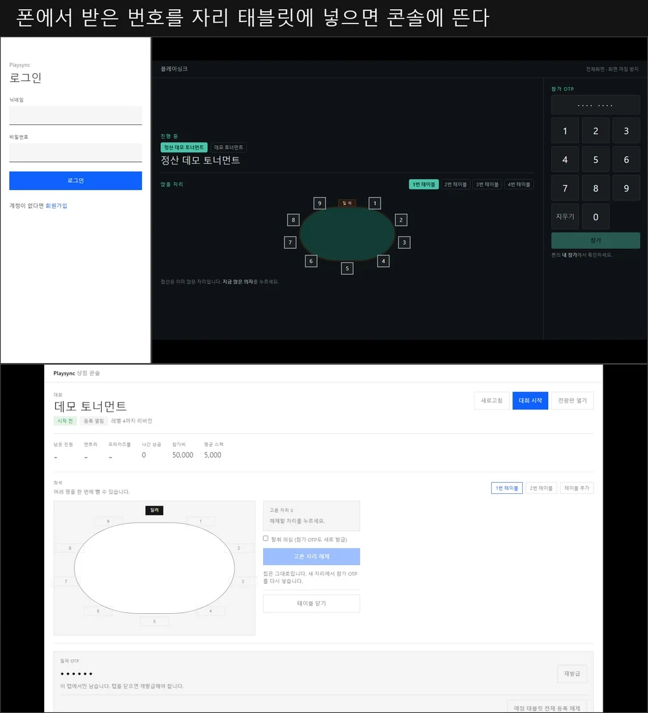
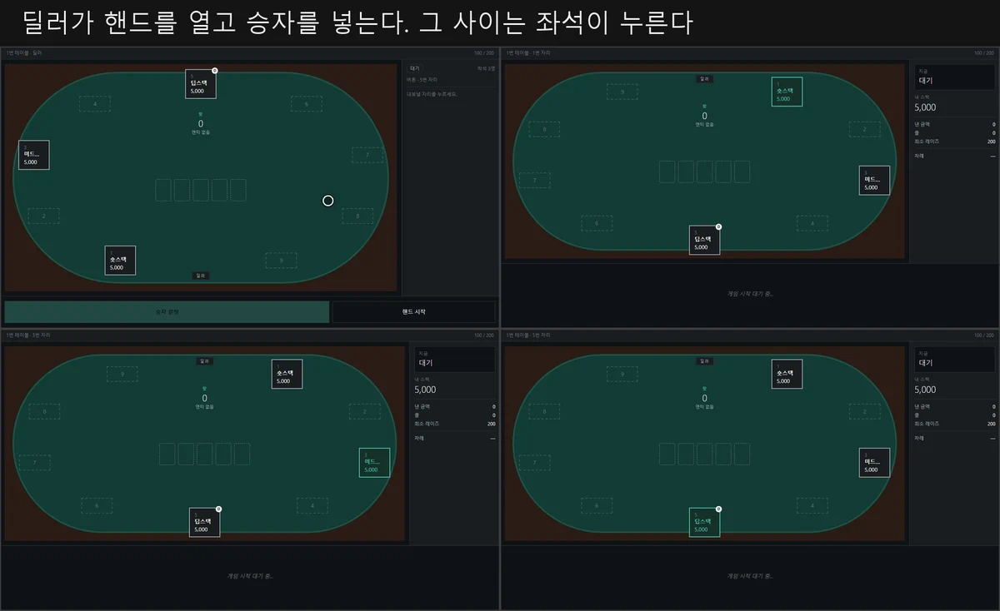
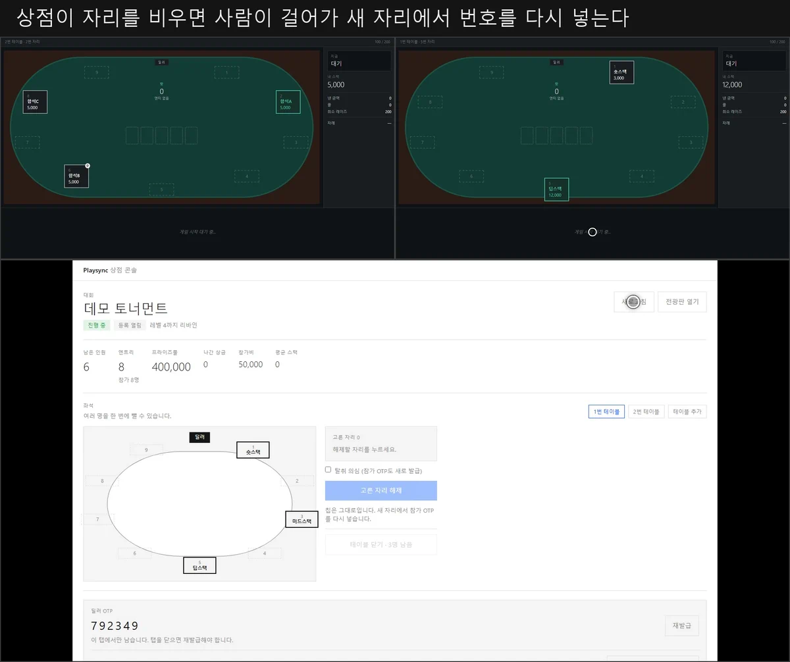
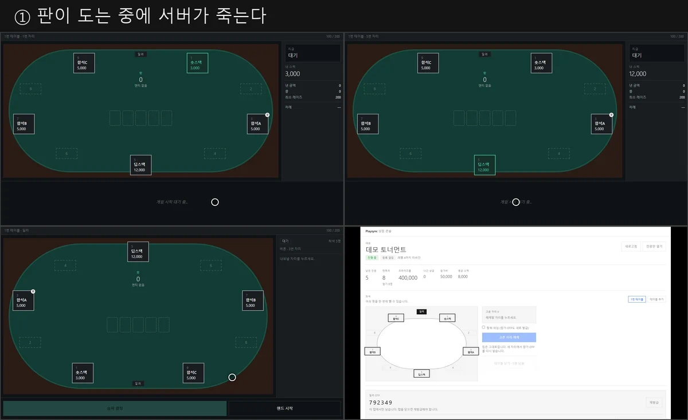
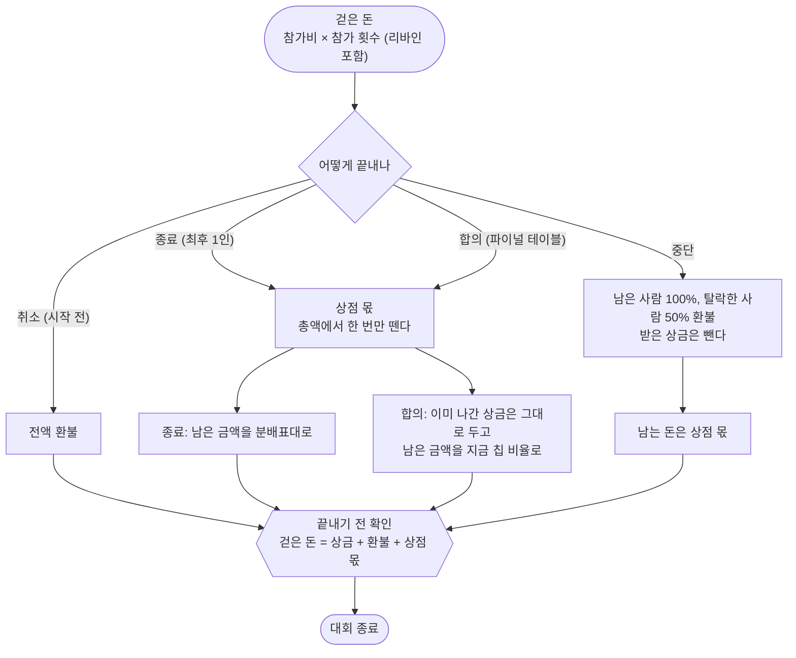
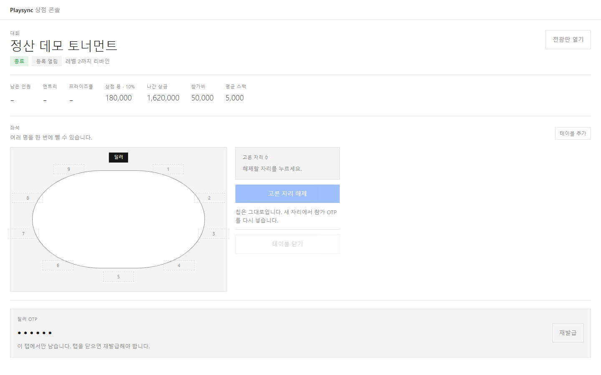
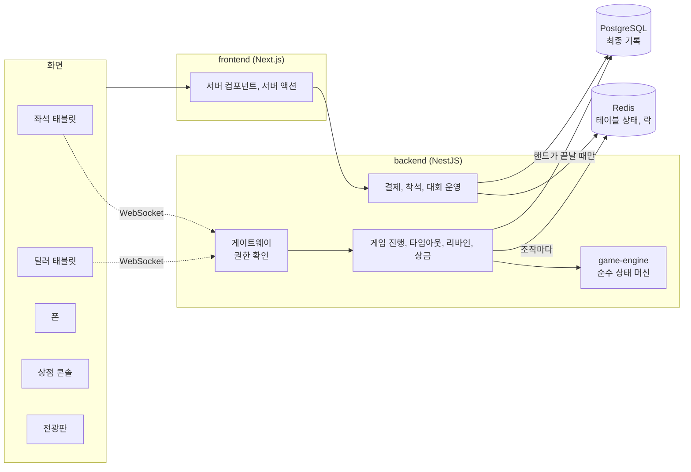

# Playsync V2

**오프라인 홀덤 대회를 운영하는 시스템입니다.** 카드는 사람 딜러가 실물로 돌리고,
칩과 팟, 좌석, 상금은 서버가 관리합니다. 참가자의 폰, 자리의 태블릿, 딜러의 태블릿,
상점 콘솔, 전광판이 같은 대회를 함께 봅니다.

```
TypeScript, NestJS 11, Next.js, PostgreSQL, Redis, zod, npm workspaces
```

아래 그림은 촬영 스크립트가 실제 서버와 브라우저를 띄워 놓고 찍은 것입니다.

---

## 구현한 것

### 참가와 입장



폰에서 참가비를 내면 참가 번호를 받는다. 자리의 태블릿에 그 번호를 입력하면 앉은
것이고, 상점 콘솔에 그 사람이 표시된다. 입장은 상점이 등록한 태블릿에서만 된다.

### 게임 진행



딜러 태블릿에서 핸드를 시작하고 승자를 입력한다. 그 사이에는 좌석 태블릿에서 콜,
레이즈, 폴드를 한다. 차례 제한 시간, 블라인드 레벨, 앤티는 서버가 관리한다.

올인으로 팟이 여러 층으로 나뉘면 층마다 누가 가져갈 수 있는지 서버가 계산한다.
딜러는 순위만 입력하고, 승자가 빠진 층이 하나라도 있으면 칩을 움직이기 전에 거부한다.

칩을 다 잃은 참가자에게는 리바인을 묻는다. 거절하면 탈락이고 등수와 상금이 정해진다.

### 자리 이동



테이블을 합칠 때 서버는 좌석을 옮기지 않는다. 상점이 좌석을 비우면 참가자가 걸어가
새 자리의 태블릿에 참가 번호를 다시 입력한다. 칩은 좌석이 아니라 사람을 따라간다.

### 장애 복구



서버나 Redis가 멈췄다 돌아오면 대회를 멈춘 상태로 둔다. 딜러와 좌석 태블릿이 모두
다시 연결되면 풀리고, 끝내 돌아오지 않는 자리는 상점이 콘솔에서 연다. 그 뒤 딜러가
재개를 눌러야 게임이 이어진다. 멈춘 시간만큼 블라인드를 보정하고, 그 사이 차례였던
사람이 시간 초과로 폴드되지 않는다.

### 대회 종료와 정산

대회를 끝내는 방법은 네 가지이고 돈이 나가는 방식도 다르지만, 끝내기 전에 확인하는
것은 등식 하나다.


```mermaid
flowchart TB
    in(["걷은 돈<br/>참가비 × 참가 횟수 (리바인 포함)"]) --> door{어떻게 끝내나}
    door -->|"취소 (시작 전)"| r1["전액 환불"]
    door -->|"종료 (최후 1인)"| rake["상점 몫<br/>총액에서 한 번만 뗀다"]
    door -->|"합의 (파이널 테이블)"| rake
    rake --> p1["종료: 남은 금액을 분배표대로"]
    rake --> p2["합의: 이미 나간 상금은 그대로 두고<br/>남은 금액을 지금 칩 비율로"]
    door -->|"중단"| r2["남은 사람 100%, 탈락한 사람 50% 환불<br/>받은 상금은 뺀다"]
    r2 --> rest["남는 돈은 상점 몫"]
    r1 & p1 & p2 & rest --> gate{{"끝내기 전 확인<br/>걷은 돈 = 상금 + 환불 + 상점 몫"}}
    gate --> closed([대회 종료])
```



### 화면에 보이지 않는 것

- **동시 조작.** 딜러와 참가자가 같은 테이블을 동시에 조작해도 칩이 어긋나지 않게
  테이블마다 락을 건다.
- **권한.** 딜러는 자기 테이블만, 참가자는 자기 좌석만 조작한다. 상점이 좌석을 비우거나
  딜러를 내보내면 그 태블릿의 연결이 바로 끊긴다.

---

## 구조


```mermaid
flowchart LR
  subgraph faces["화면"]
    seat["좌석 태블릿"]
    dealerT["딜러 태블릿"]
    phone["폰"]
    console["상점 콘솔"]
    board["전광판"]
  end
  subgraph front["frontend (Next.js)"]
    next["서버 컴포넌트, 서버 액션"]
  end
  subgraph back["backend (NestJS)"]
    ws["게이트웨이<br/>권한 확인"]
    play["게임 진행, 타임아웃, 리바인, 상금"]
    rest["결제, 착석, 대회 운영"]
    engine["game-engine<br/>순수 상태 머신"]
  end
  redis[("Redis<br/>테이블 상태, 락")]
  db[("PostgreSQL<br/>최종 기록")]
  faces --> next
  seat -. WebSocket .-> ws
  dealerT -. WebSocket .-> ws
  next --> rest
  ws --> play --> engine
  play -- 조작마다 --> redis
  play -- 핸드가 끝날 때만 --> db
  rest --> redis
  rest --> db
```

npm workspaces 모노레포다. `backend`(NestJS), `frontend`(Next.js),
`packages/contract`(백엔드와 프론트가 함께 쓰는 zod 스키마)로 나뉜다. 조작할 때마다
Redis만 바뀌고, PostgreSQL에는 핸드가 끝날 때만 쓴다.

---

## 테스트

| 계층 | 필요한 환경 | 확인하는 것 |
|---|---|---|
| 단위 | 없음 | 게임 엔진 같은 순수 로직 |
| 통합 | 실제 Redis, PostgreSQL 컨테이너 | 락과 트랜잭션 |
| 시나리오 | 위와 같음 | 대회 하나를 처음부터 끝까지. 단계마다 칩 총량과 장부를 확인한다 |
| 화면 회귀 | 시드 데이터와 백엔드 (Playwright) | 화면의 응답 형식과 상태 변화 |
| 실제 kill | 전용 컨테이너와 빌드한 백엔드 | Redis와 백엔드를 `docker kill`로 죽였다 살린 뒤의 복구 |
| 부하 | 1코어 컨테이너와 k6 | 접속 인원을 늘려 가며 응답 시간을 잰다 |

---

## 실행

```bash
npm install
cd backend && docker compose up -d   # PostgreSQL, Redis, 마이그레이션, 데모 시드
npm run dev:backend                  # http://localhost:3001
npm run dev:frontend                 # http://localhost:3000
```

`backend/.env.example`과 `frontend/.env.example`을 각각 `.env`로 복사해 쓴다. 시드는
기존 데이터를 지우고 새로 만들며, 계정과 참가 번호를 터미널에 출력한다.

도메인 규칙과 코드 위치는 [`docs/domain.md`](./docs/domain.md)에 있다.
